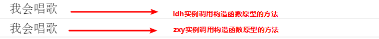
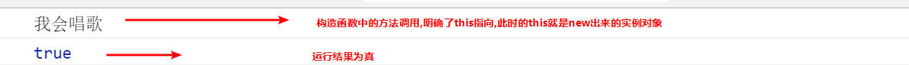

## JS基础语法

### 杂七杂八

```
1. 循环注册事件时，考虑能不能用事件委托替代。
2. input文本框获得焦点事件—— a.focus()
3. 按钮禁用——btn.disabled = true
4. 检测选项框是否被选中——this.checked
```


### 输入输出

```javascript
    <script>
        // 这是一个输入框
        prompt('请输入您的年龄');
        // alert 弹出警示框 输出的 展示给用户的
        alert('计算的结果是');
        // console 控制台输出 给程序员测试用的  
        console.log('我是程序员能看到的');
    </script>
```


### 数据类型

#### 简单数据类型

又叫基本数据类型、值类型，在存储时，变量中存储的是值本身。

- Number

  整数、浮点数

  进制：二  八  十  十六

  最值：Number. MAX_VALUE      Number. MIN_VALUE

  特数值：Infinity     -Infinity      NaN——isNaN()

- String


- Boolean
- Null
- Undefined

typeof something

#### 数据类型转换

- 转换为字符型

  1. a.toString()
  2. String(a)
  3. a + ' ' 加号拼接字符串——最常用（隐式转换）\/

- 转换为数字型

  1. parseInt(string)  \/
  2. parseFloat(string) \/
  3. Number(string)
  4. 减号 乘号 除号——隐式转换

- 转换为布尔型

  Boolean()  代表空、否的会被转为false

#### 复杂数据类型

又叫引用类型，在存储时变量中存储的仅仅是地址（引用），通过 new 关键字创建的对象（系统对象、自定义对象），如 Object、Array、Date等；

### 数组

#### 创建数组

1. var arr = new Array();
2. var arr = [];

#### 数组中新增元素

arr[arr.length] = data;


### 函数

#### 函数声明的两种方式

```javascript
// 1、自定义函数(命名函数)
// 函数的声明，形参不需要类型var
function getSum(num1, num2) {
    console.log(num1 + num2);
	}
getSum(1, 3);
//2、函数表达式写法(匿名函数)
var fn = function(){...}；
// 调用的方式，函数调用必须写到函数体下面
fn();
```

#### arguments的使用

```javascript
// 只有函数才有 arguments对象,而且是每个函数都内置好了这个arguments
// arguments是函数的内置对象
        function fn() {
            // console.log(arguments); // 里面存储了所有传递过来的实参  arguments = [1,2,3]
            // console.log(arguments.length);
            // console.log(arguments[2]);
            // 我们可以按照数组的方式遍历arguments
            for (var i = 0; i < arguments.length; i++) {
                console.log(arguments[i]);

            }
        }
        fn(1, 2, 3);
        fn(1, 2, 3, 4, 5);
        // 伪数组 并不是真正意义上的数组
        // 1. 具有数组的 length 属性
        // 2. 按照索引的方式进行存储的
        // 3. 它没有真正数组的一些方法 pop()  push() 等等
```

#### 作用域链(就近原则)

```javascript
var a = 1;
function fn1() {
    var a = 2;
    var b = '22';
    fn2();
    function fn2() {
        var a = 3;
        fn3();
        function fn3() {
            var a = 4;
            console.log(a); //a的值 ?
            console.log(b); //b的值 ?
        }
    }
}
fn1();
```


### 对象

#### 创建对象的三种方式

1. 字面量创建对象

```javascript
// { }代表对象，里面用键值对的方式，key ： value，类似于字典
// 在用字面量方法声明一个对象时，属性与属性、方法之间用 逗号, 隔开
var star = {
    name : 'pink',
    age : 18,
    sex : '男',
    sayHi : function(){
        alert('大家好啊~');
    }
};
```

2. new Object()

   ```javascript
   //对象.属性 = 值;
   var andy = new Object();
   andy.name = 'pink';
   andy.age = 18;
   andy.sex = '男';
   andy.sayHi = function(){
       alert('大家好啊~');
   }
   ```

   

3. 构造函数

```javascript
 //      
		function Star(uname, age, sex) {
            this.name = uname;
            this.age = age;
            this.sex = sex;
            this.sing = function(sang) {
                console.log(sang);

            }
        }
        var ldh = new Star('刘德华', 18, '男'); // 调用函数返回的是一个对象
        console.log(ldh.name);
        console.log(ldh['sex']);
        ldh.sing('冰雨');
```

- 注意事项


1.   构造函数约定**首字母大写**。
2.   函数内的属性和方法前面需要添加 **this** ，表示当前对象的属性和方法。
3.   构造函数中**不需要 return 返回结果**。
4.   当我们创建对象的时候，**必须用 new 来调用构造函数**。

- 其他

  构造函数，如 Stars()，抽象了对象的公共部分，封装到了函数里面，它泛指某一大类（class）  
  创建对象，如 new Stars()，特指某一个，通过 new 关键字创建对象的过程我们也称为对象实例化

- new关键字的作用


1. 在构造函数代码开始执行之前，创建一个空对象；
2. 修改this的指向，把this指向创建出来的空对象；
3. 执行函数的代码
4. 在函数完成之后，返回this---即创建出来的对象

#### 遍历对象

```javascript
for (var k in obj) {
    console.log(k);      // 这里的 k 是属性名
    console.log(obj[k]); // 这里的 obj[k] 是属性值
}
```


### JavaScript内置对象

#### Math

| 属性、方法名          | 功能                                                 |
| --------------------- | ---------------------------------------------------- |
| Math.PI               | 圆周率                                               |
| Math.floor()          | 向下取整                                             |
| Math.ceil()           | 向上取整                                             |
| Math.round()          | 四舍五入版 就近取整   注意 -3.5   结果是  -3 (-3>-4) |
| Math.abs()            | 绝对值                                               |
| Math.max()/Math.min() | 求最大和最小值                                       |
| Math.random()         | 获取范围在[0,1)内的随机值                            |

​	注意：上面的方法使用时必须带括号

**算法：获取指定范围内的随机数**

分析：

```javascript
Math.ceil();  //向上取整。

Math.floor();  //向下取整。

Math.round();  //四舍五入。

Math.random();  //0.0 ~ 1.0 之间的一个伪随机数。【包含0不包含1】 //比如0.8647578968666494

/***************************************************************************************/

Math.ceil(Math.random()*10);      // 获取从1到10的随机整数 ，取0的概率极小。

Math.round(Math.random());   //可均衡获取0到1的随机整数。

Math.floor(Math.random()*10);  //可均衡获取0到9的随机整数。\/ 要保证准确 \/

Math.round(Math.random()*10);  //基本均衡获取0到10的随机整数，其中获取最小值0和最大值10的几率少一半。

//因为结果在0~0.4 为0，0.5到1.4为1...8.5到9.4为9，9.5到9.9为10。所以头尾的分布区间只有其他数字的一半。

/***************************************************************************************/

Math.floor(Math.random()*10);  //可均衡获取0到9的随机整数。\/ 要保证准确 \/

// 生成[1,max]的随机整数
parseInt(Math.random()*max,10)+1;
Math.floor(Math.random()*max)+1;
Math.ceil(Math.random()*max);

// 生成[0,max]的随机整数
// max - 期望的最大值
parseInt(Math.random()*(max+1),10);
Math.floor(Math.random()*(max+1));

// 生成[min,max]的随机整数
parseInt(Math.random()*(max-min+1)+min,10);
Math.floor(Math.random()*(max-min+1)+min);

```

#### Date

​	Date 对象和 Math 对象不一样，Date是一个构造函数，所以使用时需要实例化后才能使用其中具体方法和属性。Date 实例用来处理日期和时间

- 使用Date实例化日期对象

  - 获取当前时间必须实例化：

  ```js
  var now = new Date();
  ```

  - 获取指定时间的日期对象

  ```js
  var future = new Date('2019/5/1');
  ```

  注意：如果创建实例时并未传入参数，则得到的日期对象是当前时间对应的日期对象

- 使用Date实例的方法和属性	

  

- 通过Date实例获取总毫秒数——四种方法

  ​	总毫秒数的含义

  ​	基于1970年1月1日（世界标准时间）起的毫秒数

  ```js
  // 获得Date总的毫秒数(时间戳)  不是当前时间的毫秒数 而是距离1970年1月1号过了多少毫秒数
  // 1. 通过 valueOf()  2.getTime()
  var date = new Date();
  console.log(date);//年月日时分秒
  console.log(date.valueOf()); // 就是 我们现在时间 距离1970.1.1 总的毫秒数
  console.log(date.getTime());
  // 3. 简单的写法 (最常用的写法)
  var date1 = +new Date(); // +new Date()  返回的就是总的毫秒数
  console.log(date1);
  // 4. H5 新增的 获得总的毫秒数
  console.log(Date.now());
  ```

  

- 重要的例子

```javascript
// 实例化Date对象
var now = new Date();
// 1. 用于获取对象的原始值
console.log(date.valueOf())	
console.log(date.getTime())	
// 2. 简单写可以这么做
var now = + new Date();			
// 3. HTML5中提供的方法，有兼容性问题
var now = Date.now();
```

```javascript
//指定日期       
var date1 = new Date(2019, 10, 1);
console.log(date1); // 返回的是 11月 不是 10月 注意：month从0开始算
var date2 = new Date('2019-10-1 8:8:8');

// 格式化日期 年月日 
var date = new Date();
var year = date.getFullYear();
var month = date.getMonth() + 1;
var dates = date.getDate();
var arr = ['星期日', '星期一', '星期二', '星期三', '星期四', '星期五', '星期六'];
var day = date.getDay();
console.log('今天是：' + year + '年' + month + '月' + dates + '日 ' + arr[day]);

// 格式化日期 时分秒
var date = new Date();
console.log(date.getHours()); // 时 Numbet
console.log(date.getMinutes()); // 分
console.log(date.getSeconds()); // 秒

// 要求封装一个函数返回当前的时分秒 格式 08:08:08
function getTimer() {
            var time = new Date();
            var h = time.getHours();
            console.log(typeof h);
            h = h < 10 ? '0' + h : h;
            var m = time.getMinutes();
            m = m < 10 ? '0' + m : m;
            var s = time.getSeconds();
            s = s < 10 ? '0' + s : s;
            return h + ':' + m + ':' + s;
        }
```

- 倒计时效果——静态，不考虑定时器;；天，时，分，秒；封装成一个函数

  ```js
          // 倒计时效果
          // 1.核心算法：输入的时间减去现在的时间就是剩余的时间，即倒计时 ，但是不能拿着时分秒相减，比如 		   //05 分减去25分，结果会是负数的。
          // 2.用时间戳来做。用户输入时间总的毫秒数减去现在时间的总的毫秒数，得到的就是剩余时间的毫秒数。
          // 3.把剩余时间总的毫秒数转换为天、时、分、秒 （时间戳转换为时分秒）
          // 转换公式如下： 
          //  d = parseInt(总秒数/ 60/60 /24);    //  计算天数
          //  h = parseInt(总秒数/ 60/60 %24)   //   计算小时
          //  m = parseInt(总秒数 /60 %60 );     //   计算分数
          //  s = parseInt(总秒数%60);            //   计算当前秒数
          function countDown(time) {
              var nowTime = +new Date(); // 返回的是当前时间总的毫秒数
              var inputTime = +new Date(time); // 返回的是用户输入时间总的毫秒数
              var times = (inputTime - nowTime) / 1000; // times是剩余时间总的秒数 
              var d = parseInt(times / 60 / 60 / 24); // 天
              d = d < 10 ? '0' + d : d;
              var h = parseInt(times / 60 / 60 % 24); //时
              h = h < 10 ? '0' + h : h;
              var m = parseInt(times / 60 % 60); // 分
              m = m < 10 ? '0' + m : m;
              var s = parseInt(times % 60); // 当前的秒
              s = s < 10 ? '0' + s : s;
              return d + '天' + h + '时' + m + '分' + s + '秒';
          }
          console.log(countDown('2021-5-1 18:00:00'));
  ```

  

#### 数组

- 创建数组的两种方式(上文)

- 检测是否为数组——两种方法

  - instanceof 运算符

    - instanceof 可以判断一个对象是否是某个构造函数的实例

      ```js
      var arr = [1, 23];
      var obj = {};
      console.log(arr instanceof Array); // true
      console.log(obj instanceof Array); // false
      ```

  - Array.isArray()

    - Array.isArray()用于判断一个对象是否为数组，isArray() 是 HTML5 中提供的方法

      ```js
      var arr = [1, 23];
      var obj = {};
      console.log(Array.isArray(arr));   // true
      console.log(Array.isArray(obj));   // false
      ```


- 添加删除数组元素

  数组中有进行增加、删除元素的方法，部分方法如下表

  

  ​	注意：push、unshift为增加元素方法；pop、shift为删除元素的方法

- 数组排序

  

  注意：sort方法需要传入参数来设置升序、降序排序

  - 如果传入“function(a,b){ return a-b;}”，则为升序
  - 如果传入“function(a,b){ return b-a;}”，则为降序

- 数组索引

  

- 数组转为字符串

  

  注意：join方法如果不传入参数，则按照 “ , ”拼接元素

- 其他

  

- ES6扩展的Array方法

见后面JS高级


#### 字符串——不可变

- **基本包装类型**

​		为了方便操作基本数据类型，JavaScript 还提供了三个特殊的引用类型：String、Number和 Boolean。

​		基本包装类型就是把简单数据类型包装成为复杂数据类型，这样基本数据类型就有了属性和方法。

```js
// 下面代码有什么问题？
var str = 'andy';
console.log(str.length);
```

​		按道理基本数据类型是没有属性和方法的，而对象才有属性和方法，但上面代码却可以执行，这是因为

​		js 会把基本数据类型包装为复杂数据类型，其执行过程如下 ：

```js
// 1. 生成临时变量，把简单类型包装为复杂数据类型
var temp = new String('andy');
// 2. 赋值给我们声明的字符变量
str = temp;
// 3. 销毁临时变量
temp = null;
```

- **根据字符返回位置**

  

  ​		案例：查找字符串"abcoefoxyozzopp"中所有o出现的位置以及次数

  1. 先查找第一个o出现的位置
  2. 然后 只要indexOf 返回的结果不是 -1 就继续往后查找
  3. 因为indexOf 只能查找到第一个，所以后面的查找，利用第二个参数，当前索引加1，从而继续查找 	

- **根据位置返回字符**

  

  ​		案例：判断一个字符串 'abcoefoxyozzopp' 中出现次数最多的字符，并统计其次数

  1. 核心算法：利用 charAt(） 遍历这个字符串

  2. 把每个字符都存储给对象， 如果对象没有该属性，就为1，如果存在了就 +1

  3. 遍历对象，得到最大值和该字符 	

     ​	注意：在遍历的过程中，把字符串中的每个字符作为对象的属性存储在对象总，对应的属性值是该字符出现的次数

- **字符串操作方法**

  

- replace()方法

​		replace() 方法用于在字符串中用一些字符替换另一些字符，其使用格式如下：  

```
字符串.replace(被替换的字符串， 要替换为的字符串)；
```

- split()方法

​		split()方法用于切分字符串，它可以将字符串切分为数组。在切分完毕之后，返回的是一个新数组。

​		其使用格式如下：

```
字符串.split("分割字符")
```

- ES6扩展的String方法

见后面JS高级

## WebAPI

### 获取元素

```js
//id
var a = getElementById('idname');
var a = querySelector('#idname');//H5新增
//标签元素
var a = getElementsByTagName('tagname');//有可能是集合
var a = querySelector('tagname');
var a = querySelectorAll('tagname');//a[0] 遍历a[i]
//class
var a = getElementsByClassName('cn');//有可能是集合  H5新增
var a = querySelector('.cn');
```

### 常见的鼠标事件


- **鼠标事件对象**


```js
//案例：跟随鼠标的天使
    
    <script>
        var pic = document.querySelector('img');
        document.addEventListener('mousemove', function(e) {
        	// 1. mousemove只要我们鼠标移动1px 就会触发这个事件
        	// 2.核心原理： 每次鼠标移动，我们都会获得最新的鼠标坐标， 
            // 把这个x和y坐标做为图片的top和left 值就可以移动图片
        	var x = e.pageX;
        	var y = e.pageY;
        	console.log('x坐标是' + x, 'y坐标是' + y);
        	//3 . 千万不要忘记给left 和top 添加px 单位
        	pic.style.left = x - 50 + 'px';
        	pic.style.top = y - 40 + 'px';
    	});
    </script>
```

### 常见的键盘事件


- **键盘事件对象**


```js
//模拟京东按下s键,光标定位到搜索框 keyCode == 83
    <input type="text">
    <script>
        // 获取输入框
        var search = document.querySelector('input');
		// 给document注册keyup事件
        document.addEventListener('keyup', function(e) {
            // 判断keyCode的值
            if (e.keyCode === 83) {
                // 触发输入框的获得焦点事件
                search.focus();
            }
        })
    </script>
//模拟京东快递单号查询
    <div class="search">
        <div class="con">123</div>
        <input type="text" placeholder="请输入您的快递单号" class="jd">
    </div>
    <script>
        // 获取要操作的元素
        var con = document.querySelector('.con');
        var jd_input = document.querySelector('.jd');
		// 给输入框注册keyup事件
        jd_input.addEventListener('keyup', function() {
				// 判断输入框内容是否为空
                if (this.value == '') {
                    // 为空，隐藏放大提示盒子
                    con.style.display = 'none';
                } else {
                    // 不为空，显示放大提示盒子，设置盒子的内容
                    con.style.display = 'block';
                    con.innerText = this.value;
                }
            })
        // 给输入框注册失去焦点事件，隐藏放大提示盒子
        jd_input.addEventListener('blur', function() {
                con.style.display = 'none';
            })
        // 给输入框注册获得焦点事件
        jd_input.addEventListener('focus', function() {
            // 判断输入框内容是否为空
            if (this.value !== '') {
                // 不为空则显示提示盒子
                con.style.display = 'block';
            }
        })
    </script>
```


### 操作元素

- 改变元素内容  element.innerHTML   element.innerText

- 常用元素的属性操作

  ```js
  //点击按钮显示图片
  <body>
      <button id="ldh">刘德华</button>
      <button id="zxy">张学友</button> <br>
      
      <script>
          // 修改元素属性  src
          // 1. 获取元素
          var ldh = document.getElementById('ldh');
          var zxy = document.getElementById('zxy');
          var img = document.querySelector('img');
          // 2. 注册事件  处理程序
          zxy.onclick = function() {
              img.src = 'images/zxy.jpg';
              img.title = '张学友思密达';
          }
          ldh.onclick = function() {
              img.src = 'images/ldh.jpg';
              img.title = '刘德华';
          }
      </script>
  </body>
  
  /************************************************************************************/
  
  //案例：分时问候
          // 根据系统不同时间来判断，所以需要用到日期内置对象
          // 利用多分支语句来设置不同的图片
          // 需要一个图片，并且根据时间修改图片，就需要用到操作元素src属性
          // 需要一个div元素，显示不同问候语，修改元素内容即可
          // 1.获取元素
          var img = document.querySelector('img');
          var div = document.querySelector('div');
          // 2. 得到当前的小时数
          var date = new Date();
          var h = date.getHours();
          // 3. 判断小时数改变图片和文字信息
          if (h < 12) {
              img.src = 'images/s.gif';
              div.innerHTML = '亲，上午好，好好写代码';
          } else if (h < 18) {
              img.src = 'images/x.gif';
              div.innerHTML = '亲，下午好，好好写代码';
          } else {
              img.src = 'images/w.gif';
              div.innerHTML = '亲，晚上好，好好写代码';
          }
  ```

  

- 表单元素的属性操作

  

  表单元素中有一些属性如：disabled、checked、selected，元素对象的这些属性的值是布尔型。

  ```js
  <body>
      <button>按钮</button>
      <input type="text" value="输入内容">
      <script>
          // 1. 获取元素
          var btn = document.querySelector('button');
          var input = document.querySelector('input');
          // 2. 注册事件 处理程序
          btn.onclick = function() {
              // 表单里面的值 文字内容是通过 value 来修改的
              input.value = '被点击了';
              // 如果想要某个表单被禁用 不能再点击 disabled  我们想要这个按钮 button禁用
              // btn.disabled = true;
              this.disabled = true;
              // this 指向的是事件函数的调用者 btn
          }
      </script>
  </body>
  
  /************************************************************************************/
  //案例：仿京东显示隐藏密码
      <div class="box">
          <label for="">
              
          </label>
          <input type="password" name="" id="pwd">
      </div>
      <script>
          // 1. 获取元素
          var eye = document.getElementById('eye');
          var pwd = document.getElementById('pwd');
          // 2. 注册事件 处理程序
          var flag = 0;
          eye.onclick = function() {
              // 点击一次之后， flag 一定要变化
              if (flag == 0) {
                  pwd.type = 'text';
                  eye.src = 'images/open.png';
                  flag = 1; // 赋值操作
              } else {
                  pwd.type = 'password';
                  eye.src = 'images/close.png';
                  flag = 0;
              }
          }
  ```

  

- 样式属性操作

  1. style

     element.style.display = 'value' ;

     ```js
     <body>
         <div></div>
         <script>
             // 1. 获取元素
             var div = document.querySelector('div');
             // 2. 注册事件 处理程序
             div.onclick = function() {
                 // div.style里面的属性 采取驼峰命名法 
                 this.style.backgroundColor = 'purple';
                 this.style.width = '250px';
             }
         </script>
     </body>
     
     /********************************************************************************/
     //案例：淘宝点击关闭二维码
     <body>
         <div class="box">
             淘宝二维码
             
             <i class="close-btn">×</i>
         </div>
         <script>
             // 1. 获取元素 
             var btn = document.querySelector('.close-btn');
             var box = document.querySelector('.box');
             // 2.注册事件 程序处理
             btn.onclick = function() {
                 box.style.display = 'none';
             }
         </script>
     </body>
     
     //案例：循环精灵图背景
     <body>
         <div class="box">
             <ul>
                 <li></li>
                 <li></li>
                 <li></li>
                 <li></li>
                 <li></li>
                 <li></li>
                 <li></li>
                 <li></li>
                 <li></li>
                 <li></li>
                 <li></li>
                 <li></li>
             </ul>
         </div>
         <script>
             // 1. 获取元素 所有的小li 
             var lis = document.querySelectorAll('li');
             for (var i = 0; i < lis.length; i++) {
                 // 让索引号 乘以 44 就是每个li 的背景y坐标  index就是我们的y坐标
                 var index = i * 44;
                 lis[i].style.backgroundPosition = '0 -' + index + 'px';
             }
         </script>
     </body>
     
     //案例：显示隐藏文本框内容
     <body>
         <input type="text" value="手机">
         <script>
             // 1.获取元素
             var text = document.querySelector('input');
             // 2.注册事件 获得焦点事件 onfocus 
             text.onfocus = function() {
                     // console.log('得到了焦点');
                     if (this.value === '手机') {
                         this.value = '';
                     }
                     // 获得焦点需要把文本框里面的文字颜色变黑
                     this.style.color = '#333';
                 }
                 // 3. 注册事件 失去焦点事件 onblur
             text.onblur = function() {
                 // console.log('失去了焦点');
                 if (this.value === '') {
                     this.value = '手机';
                 }
                 // 失去焦点需要把文本框里面的文字颜色变浅色
                 this.style.color = '#999';
             }
         </script>
     
     </body>
     
     ```

     

  2. className

     ```js
     <body>
         <div class="first">文本</div>
         <script>
             // 1. 使用 element.style 获得修改元素样式  如果样式比较少 或者 功能简单的情况下使用
             var test = document.querySelector('div');
             test.onclick = function() {
                 // this.style.backgroundColor = 'purple';
                 // this.style.color = '#fff';
                 // this.style.fontSize = '25px';
                 // this.style.marginTop = '100px';
                 // 让我们当前元素的类名改为了 change
     
                 // 2.我们可以通过修改元素的className更改元素的样式,适合于样式较多或者功能复杂的情况
                 // 3.如果想要保留原先的类名，我们可以这么做 多类名选择器
                 // this.className = 'change';
                 this.className = 'first change';
             }
         </script>
     </body>
     /********************************************************************************/
     //案例：密码框格式提醒——仿新浪注册页面
     <body>
         <div class="register">
             <input type="password" class="ipt">
             <p class="message">请输入6~16位密码</p>
         </div>
         <script>
             // 首先判断的事件是表单失去焦点 onblur
             // 如果输入正确则提示正确的信息颜色为绿色小图标变化
             // 如果输入不是6到16位，则提示错误信息颜色为红色 小图标变化
             // 因为里面变化样式较多，我们采取className修改样式
             // 1.获取元素
             var ipt = document.querySelector('.ipt');
             var message = document.querySelector('.message');
             //2. 注册事件 失去焦点
             ipt.onblur = function() {
                 // 根据表单里面值的长度 ipt.value.length
                 if (this.value.length < 6 || this.value.length > 16) {
                     // console.log('错误');
                     message.className = 'message wrong';
                     message.innerHTML = '您输入的位数不对要求6~16位';
                 } else {
                     message.className = 'message right';
                     message.innerHTML = '您输入的正确';
                 }
             }
         </script>
     </body>
     ```

     

### 排他思想

```js
    <button>按钮1</button>
    <button>按钮2</button>
    <button>按钮3</button>
    <button>按钮4</button>
    <button>按钮5</button>
    <script>
        // 1. 获取所有按钮元素
        var btns = document.getElementsByTagName('button');
        // btns得到的是伪数组  里面的每一个元素 btns[i]
        for (var i = 0; i < btns.length; i++) {
            btns[i].onclick = function() {
                // (1) 我们先把所有的按钮背景颜色去掉  干掉所有人
                for (var i = 0; i < btns.length; i++) {
                    btns[i].style.backgroundColor = '';
                }
                // (2) 然后才让当前的元素背景颜色为pink 留下我自己
                this.style.backgroundColor = 'pink';

            }
        }
    </script>

/***************************************************************************************/
//案例：百度换肤
<body>
    <ul class="baidu">
        <li></li>
        <li></li>
        <li></li>
        <li></li>
    </ul>
    <script>
        // 1. 获取元素 
        //var imgs = document.querySelector('.baidu').querySelectorAll('img');
        var imgs = document.querySelectorAll('img');
        // 2. 循环注册事件 
        for (var i = 0; i < imgs.length; i++) {
            imgs[i].onclick = function() {
                // this.src 就是我们点击图片的路径   images/2.jpg
                // 把这个路径 this.src 给body 就可以了
                document.body.style.backgroundImage = 'url(' + this.src + ')';
            }
        }
    </script>
</body>

//案例：全选
    <script>
        // 1. 全选和取消全选做法：  让下面所有复选框的checked属性（选中状态） 跟随 全选按钮即可
        // 获取元素
        
        var j_cbAll = document.getElementById('j_cbAll'); 
        var j_tbs = document.getElementById('j_tb').getElementsByTagName('input'); 
        // 全选按钮注册事件
        j_cbAll.onclick = function() {
                // this.checked 当前复选框的选中状态
                console.log(this.checked);
                for (var i = 0; i < j_tbs.length; i++) {
                    j_tbs[i].checked = this.checked;
                }
         }
         // 给所有的子复选框注册单击事件
        for (var i = 0; i < j_tbs.length; i++) {
            j_tbs[i].onclick = function() {
                // flag 控制全选按钮是否选中
                var flag = true;
                // 每次点击下面的复选框都要循环检查者4个小按钮是否全被选中
                for (var i = 0; i < j_tbs.length; i++) {
                    if (!j_tbs[i].checked) {
                        flag = false;
                        break; 
                    }
                }
                // 设置全选按钮的状态
                j_cbAll.checked = flag;
            }
        }
    </script>

```

### 自定义属性操作

- 获取属性值

  element.属性   获取内置属性值(元素本身自带的属性)

  element.getAttribute('属性')   获取自定义属性值

- 设置属性值

  element.属性 = '值';

  element.setAttribute('属性', '值');  eg. div.setAttribute('class' , 'footer'); 设置类名特殊\/

- 移除属性

  element.removeAttribute('属性');  //注意class特殊

- H5自定义属性

  ```js
      <div data-list-name="andy"></div>
      <script>
          var div = document.querySelector('div');
  		//h5设置自定义属性，规定data-开头
  		div.setAttribute('data-index',2);
  		//传统获取自定义属性的方法
          console.log(div.getAttribute('data-index'));
          console.log(div.getAttribute('data-list-name'));
          // h5新增的获取自定义属性的方法 它只能获取data-开头的
          // dataset 是一个集合里面存放了所有以data开头的自定义属性
          console.log(div.dataset);
          console.log(div.dataset.index);
          console.log(div.dataset['index']);
          // 如果自定义属性里面有多个-链接的单词，我们获取的时候采取 驼峰命名法
          console.log(div.dataset.listName);
          console.log(div.dataset['listName']);
      </script>
  ```

  

```js
//案例：Tab栏切换
    <script>
        // 获取元素
        var tab_list = document.querySelector('.tab_list');
        var lis = tab_list.querySelectorAll('li');
        var items = document.querySelectorAll('.item');
        // for循环，给选项卡绑定点击事件
        for (var i = 0; i < lis.length; i++) {
            // 开始给5个小li 设置索引号 
            lis[i].setAttribute('index', i);
            lis[i].onclick = function() {
                // 1. 上的模块选项卡，当前这一个底色会是红色，其余不变（排他思想）
                // 干掉所有人 其余的li清除 class 这个类
                for (var i = 0; i < lis.length; i++) {
                    lis[i].className = '';
                }
                // 留下我自己 
                this.className = 'current';
                // 2. 下面的显示内容模块
                var index = this.getAttribute('index');
                console.log(index);
                // 干掉所有人 让其余的item 这些div 隐藏
                for (var i = 0; i < items.length; i++) {
                    items[i].style.display = 'none';
                }
                // 留下我自己 让对应的item 显示出来
                items[index].style.display = 'block';
            }
        }
    </script>
```


### 节点操作

​	网页中的所有内容都是节点（标签、属性、文本、注释等），在DOM 中，节点使用 node 来表示。

​	HTML DOM 树中的所有节点均可通过 JavaScript 进行访问，所有 HTML 元素（节点）均可被修改，也可以创建或删除。

​	一般地，节点至少拥有nodeType（节点类型）、nodeName（节点名称）和nodeValue（节点值）这三个基本属性。


- **父子元素节点**

```js
//父元素节点
element.parentNode
//子元素节点集合(非标准方法，但个浏览器均支持)，childNodes子节点包括了文本节点，不用
element.children
//第一个子节点，最后一个子节点——实际开发方式
element.children[0]
element.children[element.children.length-1]
//ie9以上支持(兼容性)
element.firstElementChild
element.lastElementChild
/**************************************************************************************/
//案例：新浪下拉菜单——ul里边四个li，每个li里边一个a一个ul
    <script>
        // 1. 获取元素
        var nav = document.querySelector('.nav');
        var lis = nav.children; // 得到4个小li
        // 2.循环注册事件
        for (var i = 0; i < lis.length; i++) {
            lis[i].onmouseover = function() {
                this.children[1].style.display = 'block';
            }
            lis[i].onmouseout = function() {
                this.children[1].style.display = 'none';
            }
        }
    </script>


```

- **兄弟元素节点**

```js
//兄弟节点,包含文本节点的没有Element，不考虑用
console.log(div.nextElementSibling);
console.log(div.previousElementSibling);
```

- **创建、添加、删除元素节点**

```js
    <script>
        // 1. 创建节点元素节点
        var li = document.createElement('li');
        // 2. 添加节点 node.appendChild(child)  node 父级  child 是子级 后面追加元素  类似于数组中的push
        var ul = document.querySelector('ul');
        ul.appendChild(li);
        // 3. 添加节点 node.insertBefore(child, 指定元素);
        var lili = document.createElement('li');
        ul.insertBefore(lili, ul.children[0]);
		// 4. 删除元素节点 node.removeChild(child) node父级 child子级
		ul.removeChild(ul.children[0]);
    </script>

/**************************************************************************************/
//案例：发布留言，删除留言
    <textarea name="" id=""></textarea>
    <button>发布</button>
    <ul>

    </ul>
    <script>
        // 1. 获取元素
        var btn = document.querySelector('button');
        var text = document.querySelector('textarea');
        var ul = document.querySelector('ul');
        // 2. 注册事件
        btn.onclick = function() {
            if (text.value == '') {
                alert('您没有输入内容');
                return false;
            } else {
                // console.log(text.value);
                // (1) 创建元素
                var li = document.createElement('li');
                // 先有li 才能赋值
                li.innerHTML = text.value + "<a href='javascript:;'>删除</a>";
                // (2) 添加元素
                // ul.appendChild(li);
                ul.insertBefore(li, ul.children[0]);
                // (3) 删除元素 删除的是当前链接的li  它的父亲
                var as = document.querySelectorAll('a');
                for (var i = 0; i < as.length; i++) {
                    as[i].onclick = function() {
                        // 删除的是 li 当前a所在的li  this.parentNode;
                        ul.removeChild(this.parentNode);
                    }
                }
            }
        }
    </script>

//案例：动态生成表格
    <script>
        // 1.先去准备好学生的数据
        var datas = [{
            name: '魏璎珞',
            subject: 'JavaScript',
            score: 100
        }, {
            name: '弘历',
            subject: 'JavaScript',
            score: 98
        }, {
            name: '傅恒',
            subject: 'JavaScript',
            score: 99
        }, {
            name: '明玉',
            subject: 'JavaScript',
            score: 88
        }, {
            name: '大猪蹄子',
            subject: 'JavaScript',
            score: 0
        }];
        // 2. 往tbody 里面创建行： 有几个人（通过数组的长度）我们就创建几行
        var tbody = document.querySelector('tbody');
		// 遍历数组
        for (var i = 0; i < datas.length; i++) { 
            // 1. 创建 tr行
            var tr = document.createElement('tr');
            tbody.appendChild(tr);
            // 2. 行里面创建单元格td 单元格的数量取决于每个对象里面的属性个数  
            // 使用for in遍历学生对象
            for (var k in datas[i]) { 
                // 创建单元格 
                var td = document.createElement('td');
                // 把对象里面的属性值 datas[i][k] 给 td  
                td.innerHTML = datas[i][k];
                tr.appendChild(td);
            }
            // 3. 创建有删除2个字的单元格 
            var td = document.createElement('td');
            td.innerHTML = '<a href="javascript:;">删除 </a>';
            tr.appendChild(td);

        }
        // 4. 删除操作 开始 
        var as = document.querySelectorAll('a');
        for (var i = 0; i < as.length; i++) {
            as[i].onclick = function() {
                // 点击a 删除 当前a 所在的行(链接的爸爸的爸爸)  node.removeChild(child)  
                tbody.removeChild(this.parentNode.parentNode)
            }
        }
    </script>
```

- **复制节点**

  1. node.cloneNode(); 括号为空或者里面是false 浅拷贝 只复制标签不复制里面的内容

  2. node.cloneNode(true); 括号为true 深拷贝 复制标签复制里面的内容

- **创建元素的三种方式**


### 事件操作

#### 注册事件


- **addEventListener(type, listener, useCapture)**

eventTarget.addEventListener()方法将指定的监听器注册到 eventTarget（目标对象）上，当该对象触发指定的事件时，就会执行事件处理函数。


- **eventTarget.attachEvent(eventNameWithOn, callback)**


```js
<button>传统注册事件</button>
<button>方法监听注册事件</button>
<button>ie9 attachEvent</button>
<script>
    var btns = document.querySelectorAll('button');
    // 1. 传统方式注册事件
    btns[0].onclick = function() {
        alert('hi');
    }
    btns[0].onclick = function() {
            alert('hao a u');
        }
   // 2. 事件侦听注册事件 addEventListener 
   // (1) 里面的事件类型是字符串 必定加引号 而且不带on
   // (2) 同一个元素 同一个事件可以添加多个侦听器（事件处理程序）
    btns[1].addEventListener('click', function() {
        alert(22);
    })
    btns[1].addEventListener('click', function() {
            alert(33);
    })
    // 3. attachEvent ie9以前的版本支持
    btns[2].attachEvent('onclick', function() {
        alert(11);
    })
</script>
```

- **事件监听兼容性解决方案**

封装一个函数，函数中判断浏览器的类型


#### 删除事件


```js
    <div>1</div>
    <div>2</div>
    <div>3</div>
    <script>
        var divs = document.querySelectorAll('div');
        divs[0].onclick = function() {
            alert(11);
            // 1. 传统方式删除事件
            divs[0].onclick = null;
        }
        // 2. removeEventListener 删除事件
        divs[1].addEventListener('click', fn) // 里面的fn 不需要调用加小括号
        function fn() {
            alert(22);
            divs[1].removeEventListener('click', fn);
        }
        // 3. detachEvent
        divs[2].attachEvent('onclick', fn1);

        function fn1() {
            alert(33);
            divs[2].detachEvent('onclick', fn1);
        }
    </script>
```

- **删除事件兼容性解决方案 **


#### DOM事件流

DOM 事件流会经历3个阶段： 

1. 捕获阶段
2. 当前目标阶段
3. 冒泡阶段 


#### 事件对象

事件发生后，跟事件相关的一系列信息数据的集合都放到这个对象里面，这个对象就是事件对象。

比如：  

1. 谁绑定了这个事件。
2. 鼠标触发事件的话，会得到鼠标的相关信息，如鼠标位置。
3. 键盘触发事件的话，会得到键盘的相关信息，如按了哪个键。

- **事件对象的属性和方法**


- **e.target 和 this 的区别**
  - this 是事件绑定的元素（绑定这个事件处理函数的元素） 。
  - e.target 是事件触发的元素。

  ```js
      <ul>
          <li>abc</li>
          <li>abc</li>
          <li>abc</li>
      </ul>
      <script>
          var ul = document.querySelector('ul');
          ul.addEventListener('click', function(e) {
                // 我们给ul 绑定了事件  那么this 就指向ul  
                console.log(this); // ul
  
                // e.target 触发了事件的对象 我们点击的是li e.target 指向的就是li
                console.log(e.target); // li
          });
      </script>
  ```

  

#### 禁止默认行为


```js
<body>
    我是一段不愿意分享的文字
    <script>
        // 1. contextmenu 我们可以禁用右键菜单
        document.addEventListener('contextmenu', function(e) {
                e.preventDefault();
        })
        // 2. 禁止选中文字 selectstart
        document.addEventListener('selectstart', function(e) {
            e.preventDefault();
        })
    </script>
</body>
```


#### 阻止事件冒泡


​		**兼容性处理**


#### 事件委托

说白了就是，不给子元素注册事件，给父元素注册事件，把处理代码在父元素的事件中执行。

- **事件委托的原理**

​	给父元素注册事件，利用事件冒泡，当子元素的事件触发，会冒泡到父元素，然后去控制相应的子元素。

- **事件委托的作用**
  - 我们只操作了一次 DOM ，提高了程序的性能。

  - 动态新创建的子元素，也拥有事件。

```js
    <ul>
        <li>知否知否，点我应有弹框在手！</li>
        <li>知否知否，点我应有弹框在手！</li>
        <li>知否知否，点我应有弹框在手！</li>
        <li>知否知否，点我应有弹框在手！</li>
        <li>知否知否，点我应有弹框在手！</li>
    </ul>
    <script>
        // 事件委托的核心原理：给父节点添加侦听器， 利用事件冒泡影响每一个子节点
        var ul = document.querySelector('ul');
        ul.addEventListener('click', function(e) {
            // e.target 这个可以得到我们点击的对象
            e.target.style.backgroundColor = 'pink';
        })
    </script>
```


### BOM——Browser Object Model


#### window


- **window对象的常见事件**
  - 页面(窗口)加载事件——两种

    **第一种**

  

  window.onload 是窗口 (页面）加载事件，**当文档内容完全加载完成**会触发该事件(包括图像、脚本文件、CSS 文件等), 就调用的处理函数。

  

  ​		**第二种**

  

  DOMContentLoaded 事件触发时，仅当DOM加载完成，不包括样式表，图片，flash等等。

  ​	IE9以上才支持！！！

  ​	如果页面的图片很多的话, 从用户访问到onload触发可能需要较长的时间, 交互效果就不能实现，必然影响用户的体验，此时用 DOMContentLoaded 事件比较合适。

  ```js
          window.addEventListener('load', function() {
              alert(22);
          })
          document.addEventListener('DOMContentLoaded', function() {
              alert(33);
          })
  ```

  

  - 调整窗口大小事件

  

  ​	window.onresize 是调整窗口大小加载事件,  当触发时就调用的处理函数。

  ​	注意：

1. 只要窗口大小发生像素变化，就会触发这个事件。
2. 我们经常利用这个事件完成响应式布局。 window.innerWidth 当前屏幕的宽度

```js
    <script>
        // 注册页面加载事件
        window.addEventListener('load', function() {
            var div = document.querySelector('div');
        	// 注册调整窗口大小事件
            window.addEventListener('resize', function() {
                // window.innerWidth 获取窗口大小
                console.log('变化了');
                if (window.innerWidth <= 800) {
                    div.style.display = 'none';
                } else {
                    div.style.display = 'block';
                }
            })
        })
    </script>
    <div></div>
```


#### 定时器——两种

window 对象给我们提供了 2 个非常好用的方法-定时器。

- setTimeout(callback , 1000) 
- setInterval()  

1. setTimeout(callback , time)


```
普通函数是按照代码顺序直接调用。

简单理解： 回调，就是回头调用的意思。上一件事干完，再回头再调用这个函数。
例如：定时器中的调用函数，事件处理函数，也是回调函数。

以前我们讲的   element.onclick = function(){}   或者  element.addEventListener(“click”, fn);   里面的 函数也是回调函数。
```

```js
//案例：5秒后关闭广告
<body>
    
    <script>
        // 获取要操作的元素
        var ad = document.querySelector('.ad');
		// 开启定时器
        setTimeout(function() {
            ad.style.display = 'none';
        }, 5000);
    </script>
</body>
//停止定时器
    <button>点击停止定时器</button>
    <script>
        var btn = document.querySelector('button');
		// 开启定时器
        var timer = setTimeout(function() {
            console.log('爆炸了');
        }, 5000);
		// 给按钮注册单击事件
        btn.addEventListener('click', function() {
            // 停止定时器
            clearTimeout(timer);
        })
    </script>
```

2. setInterval(callback , time)


```js
//京东倒计时案例
    <div>
        <span class="hour">1</span>
        <span class="minute">2</span>
        <span class="second">3</span>
    </div>
    <script>
        // 1. 获取元素（时分秒盒子） 
        var hour = document.querySelector('.hour'); // 小时的黑色盒子
        var minute = document.querySelector('.minute'); // 分钟的黑色盒子
        var second = document.querySelector('.second'); // 秒数的黑色盒子
        var inputTime = +new Date('2019-5-1 18:00:00'); // 返回的是用户输入时间总的毫秒数

        countDown(); // 我们先调用一次这个函数，防止第一次刷新页面有空白 

        // 2. 开启定时器
        setInterval(countDown, 1000);
		
        function countDown() {
            var nowTime = +new Date(); // 返回的是当前时间总的毫秒数
            var times = (inputTime - nowTime) / 1000; // times是剩余时间总的秒数 
            var h = parseInt(times / 60 / 60 % 24); //时
            h = h < 10 ? '0' + h : h;
            hour.innerHTML = h; // 把剩余的小时给 小时黑色盒子
            var m = parseInt(times / 60 % 60); // 分
            m = m < 10 ? '0' + m : m;
            minute.innerHTML = m;
            var s = parseInt(times % 60); // 当前的秒
            s = s < 10 ? '0' + s : s;
            second.innerHTML = s;
        }
    </script>
//停止定时器
clearInterval(timer);
//案例：发送短信倒计时——点击按钮后，该按钮60秒之内不能再次点击，防止重复发送短信。
    手机号码： <input type="number"> <button>发送</button>
    <script>
        var btn = document.querySelector('button');
		// 全局变量，定义剩下的秒数
        var time = 3; 
		// 注册单击事件
        btn.addEventListener('click', function() {
            // 禁用按钮
            btn.disabled = true;
            // 开启定时器
            var timer = setInterval(function() {
                // 判断剩余秒数
                if (time == 0) {
                    // 清除定时器和复原按钮
                    clearInterval(timer);
                    btn.disabled = false;
                    btn.innerHTML = '发送';
                } else {
                    btn.innerHTML = '还剩下' + time + '秒';
                    time--;
                }
            }, 1000);
        });
    </script>
```

#### this指向问题

​	this的指向在函数定义的时候是确定不了的，只有函数执行的时候才能确定this到底指向谁，一般情况下this的最终指向的是那个调用它的对象。

现阶段，我们先了解一下几个this指向

1. 全局作用域或者普通函数中this指向全局对象window（注意定时器里面的this指向window）

2. 方法调用中谁调用this指向谁
3. 构造函数中this指向构造函数的实例

#### location对象


- **URL**


- **location对象的属性**


重点记住：href 和 search

```js
//案例：五分钟自动跳转页面
    <button>点击</button>
    <div></div>
    <script>
        var btn = document.querySelector('button');
        var div = document.querySelector('div');
        btn.addEventListener('click', function() {
            // console.log(location.href);
            location.href = 'http://www.itcast.cn';
        })
        var timer = 5;
        setInterval(function() {
            if (timer == 0) {
                location.href = 'http://www.itcast.cn';
            } else {
                div.innerHTML = '您将在' + timer + '秒钟之后跳转到首页';
                timer--;
            }
        }, 1000);
    </script>
//案例：获取URL参数
    <div></div>
	<script>
        console.log(location.search); // ?uname=andy
        // 1.先去掉？  substr('起始的位置'，截取几个字符);
        var params = location.search.substr(1); // uname=andy
        console.log(params);
        // 2. 利用=把字符串分割为数组 split('=');
        var arr = params.split('=');
        console.log(arr); // ["uname", "ANDY"]
        var div = document.querySelector('div');
        // 3.把数据写入div中
        div.innerHTML = arr[1] + '欢迎您';
    </script>

```

- **location对象的常见方法**


```js
    <button>点击</button>
    <script>
        var btn = document.querySelector('button');
        btn.addEventListener('click', function() {
            // 记录浏览历史，所以可以实现后退功能
            // location.assign('http://www.itcast.cn');
            // 不记录浏览历史，所以不可以实现后退功能
            // location.replace('http://www.itcast.cn');
            location.reload(true);
        })
    </script>
```


#### navigator对象

navigator 对象包含有关浏览器的信息，它有很多属性，我们最常用的是 userAgent，该属性可以返回由客户机发送服务器的 user-agent 头部的值。

下面前端代码可以判断用户哪个终端打开页面，实现跳转

```js
if((navigator.userAgent.match(/(phone|pad|pod|iPhone|iPod|ios|iPad|Android|Mobile|BlackBerry|IEMobile|MQQBrowser|JUC|Fennec|wOSBrowser|BrowserNG|WebOS|Symbian|Windows Phone)/i))) {
    window.location.href = "";     //手机
 } else {
    window.location.href = "";     //电脑
 }
```

#### history对象

window对象给我们提供了一个 history对象，与浏览器历史记录进行交互。该对象包含用户（在浏览器窗口中）访问过的URL。


history对象一般在实际开发中比较少用，但是会在一些 OA 办公系统中见到。


#### JS执行机制

- **JS是单线程**


​		单线程就意味着，所有任务需要排队，前一个任务结束，才会执行后一个任务。如果前一个任务耗时很长，后一个任务就不得不一直等着。
​		这样所导致的问题是： 如果 JS 执行的时间过长，这样就会造成页面的渲染不连贯，导致页面渲染加载阻塞的感觉。

- **同步任务和异步任务**

单线程导致的问题就是后面的任务等待前面任务完成，如果前面任务很耗时（比如读取网络数据），后面任务不得不一直等待！！

​	为了解决这个问题，利用多核 CPU 的计算能力，HTML5 提出 Web Worker 标准，允许 JavaScript 脚本创建多个线程，但是子线程完全受主线程控制。于是，JS 中出现了**同步任务**和**异步任务**。

```js
JS中所有任务可以分成两种，一种是同步任务（synchronous），另一种是异步任务（asynchronous）。

同步任务指的是：
	在主线程上排队执行的任务，只有前一个任务执行完毕，才能执行后一个任务；
异步任务指的是：
	不进入主线程、而进入”任务队列”的任务，当主线程中的任务运行完了，才会从”任务队列”取出异步任务放入主线程执行。
```


JS执行机制(时间循环)


### 元素偏移量offset系列

offset 翻译过来就是偏移量， 我们使用 offset系列相关属性可以动态的得到该元素的位置（偏移）、大小等。

1. 获得元素距离带有定位父元素的位置

2. 获得元素自身的大小（宽度高度）

3. 注意：返回的数值都不带单位


#### offset和style区别

#### offset

- offset 可以得到任意样式表中的样式值

- offset 系列获得的数值是没有单位的

- offsetWidth 包含padding+border+width

- offsetWidth 等属性是只读属性，只能获取不能赋值

- > 所以，我们想要获取元素大小位置，用offset更合适

#### style

- style 只能得到行内样式表中的样式值

- style.width 获得的是带有单位的字符串

- style.width 获得不包含padding和border 的值

- style.width 是可读写属性，可以获取也可以赋值

- > 所以，我们想要给元素更改值，则需要用style改变
  >
  > **因为平时我们都是给元素注册触摸事件，所以重点记住 targetTouches**

```js
//案例：获取鼠标在盒子内的坐标
var box = document.querySelector('.box');
box.addEventListener('mousemove', function(e) {
var x = e.pageX - this.offsetLeft;
var y = e.pageY - this.offsetTop;
this.innerHTML = 'x坐标是' + x + ' y坐标是' + y;
})
//模态框拖拽
    <script>
        var div = document.querySelector('div');

        div.addEventListener('mousedown',function(e){
            var x = e.pageX - this.offsetLeft;
            var y = e.pageY - this.offsetTop;
            this.addEventListener('mousemove',move)
            function move(e){
                this.style.left = e.pageX - x + 'px';
                this.style.top = e.pageY - y + 'px';
            }
            this.addEventListener('mouseup',function(e){
                this.removeEventListener('mousemove',move);      
            })

        })
    </script>
```

**仿京东放大镜**

```js
    <style>
        .preview_img {
            height: 400px;
            width: 400px;
            position: relative;
            margin: 50px 50px;
            border: 1px solid red;
        }
        .mask {
            width: 300px;
            height: 300px;
            background-color: yellow;
            opacity: .5;
            position: absolute;
            left: 0;
            top: 0;
            display: none;
        }
        .big {
            width: 500px;
            height: 500px;
            overflow: hidden;
            position: absolute;
            left: 410px;
            top: 0px;
            display: none;
        }
        .big img {
            position: absolute;
            left: 0px;
            top: 0px;
        }
    </style>
</head>
<body>
    <div class="preview_img">
        
        <div class="mask"></div>
        <div class="big">
            
        </div>
    </div>

    <script>
        var preview = document.querySelector('.preview_img');
        var mask = document.querySelector('.mask');
        var big = document.querySelector('.big');
        var bigImg = document.querySelector('.bigImg');

        //1.鼠标进入产品图片区域，mask和放大镜出现，离开消失
        preview.addEventListener('mouseover',function(){
            mask.style.display = 'block';
            big.style.display = 'block';

            // this.addEventListener('mousemove',function(e){
            // var x = e.pageX - this.offsetLeft;
            // var y = e.pageY - this.offsetTop;
            // mask.style.left = x + 'px';
            // mask.style.top = y + 'px';

        //})


        })
        preview.addEventListener('mouseout',function(){
            mask.style.display = 'none';
            big.style.display = 'none';           
        })
        //2.mask跟随鼠标移动

        preview.addEventListener('mousemove',function(e){
            var x = e.pageX - this.offsetLeft;
            var y = e.pageY - this.offsetTop;
            var maskx = x - mask.offsetWidth/2;
            var masky = y - mask.offsetHeight/2;
            if(maskx < 0)
            {
                maskx = 0;
            }
            else if(maskx > 100)
            {
                maskx = 100;
            }
            if(masky < 0)
            {
                masky = 0;
            }
            else if (masky >100)
            {
                masky = 100;
            }
            mask.style.left = maskx + 'px';
            mask.style.top = masky + 'px';

            //放大镜效果
            bigImg.style.left = -maskx * (bigImg.offsetWidth-big.offsetWidth)/(preview.offsetWidth-mask.offsetWidth)+'px';
            bigImg.style.top = -masky * (bigImg.offsetHeight-big.offsetHeight)/(preview.offsetHeight-mask.offsetHeight)+'px';

        })

    </script>
</body>
```


### 元素可视区client系列

client 翻译过来就是客户端，我们使用 client 系列的相关属性来获取元素可视区的相关信息。通过 client
系列的相关属性可以动态的得到该元素的边框大小、元素大小等。


#### 淘宝 flexible.js 源码分析

```js
(function flexible(window, document) {
    // 获取的html 的根元素
    var docEl = document.documentElement
        // dpr 物理像素比
    var dpr = window.devicePixelRatio || 1

    // adjust body font size  设置我们body 的字体大小
    function setBodyFontSize() {
        // 如果页面中有body 这个元素 就设置body的字体大小
        if (document.body) {
            document.body.style.fontSize = (12 * dpr) + 'px'
        } else {
            // 如果页面中没有body 这个元素，则等着 我们页面主要的DOM元素加载完毕再去设置body
            // 的字体大小
            document.addEventListener('DOMContentLoaded', setBodyFontSize)
        }
    }
    setBodyFontSize();

    // set 1rem = viewWidth / 10    设置我们html 元素的文字大小
    function setRemUnit() {
        var rem = docEl.clientWidth / 10
        docEl.style.fontSize = rem + 'px'
    }

    setRemUnit()

    // reset rem unit on page resize  当我们页面尺寸大小发生变化的时候，要重新设置下rem 的大小
    window.addEventListener('resize', setRemUnit)
        // pageshow 是我们重新加载页面触发的事件
    window.addEventListener('pageshow', function(e) {
        // e.persisted 返回的是true 就是说如果这个页面是从缓存取过来的页面，也需要从新计算一下rem 的大小
        if (e.persisted) {
            setRemUnit()
        }
    })

    // detect 0.5px supports  有些移动端的浏览器不支持0.5像素的写法
    if (dpr >= 2) {
        var fakeBody = document.createElement('body')
        var testElement = document.createElement('div')
        testElement.style.border = '.5px solid transparent'
        fakeBody.appendChild(testElement)
        docEl.appendChild(fakeBody)
        if (testElement.offsetHeight === 1) {
            docEl.classList.add('hairlines')
        }
        docEl.removeChild(fakeBody)
    }
}(window, document))
```

立即执行函数 (function(){})()  或者 (function(){}())

主要作用： 创建一个独立的作用域。 避免了命名冲突问题

下面三种情况都会刷新页面都会触发 load 事件。

1.a标签的超链接

2.F5或者刷新按钮（强制刷新）

3.前进后退按钮

但是 火狐中，有个特点，有个“往返缓存”，这个缓存中不仅保存着页面数据，还保存了DOM和JavaScript的状态；实际上是将整个页面都保存在了内存里。

所以此时后退按钮不能刷新页面。

此时可以使用 pageshow事件来触发。，这个事件在页面显示时触发，无论页面是否来自缓存。在重新加载页面中，pageshow会在load事件触发后触发；根据事件对象中的persisted来判断是否是缓存中的页面触发的pageshow事件

`注意这个事件给window添加。`

### 元素滚动scroll系列

scroll 翻译过来就是滚动的，我们使用 scroll 系列的相关属性可以动态的得到该元素的大小、滚动距离等。

滚动条在滚动时会触发onscroll事件

页面被卷去 window.pageYOffset   window.pageXOffset


```js
//案例：仿淘宝固定右侧侧边栏

```

### 三大系列总结


他们主要用法：

1.offset系列 经常用于获得元素位置    offsetLeft  offsetTop

2.client经常用于获取元素大小  clientWidth clientHeight

3.scroll 经常用于获取滚动距离 scrollTop  scrollLeft  

4.注意页面滚动的距离通过 window.pageXOffset  获得

### mouseenter 和mouseover的区别

- 当鼠标移动到元素上时就会触发mouseenter 事件
- 类似 mouseover，它们两者之间的差别是
- mouseover 鼠标经过自身盒子会触发，经过子盒子还会触发。mouseenter  只会经过自身盒子触发
- 之所以这样，就是因为mouseenter不会冒泡
- 跟mouseenter搭配鼠标离开 mouseleave  同样不会冒泡

### 动画函数封装

- **动画实现的原理**

通过定时器setInterval()不断移动元素位置

注意：元素需要添加定位，才能使用element.style.left

- **动画函数给不同元素记录不同定时器** 

如果多个元素都使用这个动画函数，每次都要var 声明定时器。我们可以给不同的元素使用不同的定时器（自己专门用自己的定时器）。

> 核心原理：利用 JS 是一门动态语言，可以很方便的给当前对象添加属性。

```js
 function animate(obj, target) {
            // 当我们不断的点击按钮，这个元素的速度会越来越快，因为开启了太多的定时器
            // 解决方案就是 让我们元素只有一个定时器执行
            // 先清除以前的定时器，只保留当前的一个定时器执行
            clearInterval(obj.timer);
            obj.timer = setInterval(function() {
                if (obj.offsetLeft >= target) {
                    // 停止动画 本质是停止定时器
                    clearInterval(obj.timer);
                }
                obj.style.left = obj.offsetLeft + 1 + 'px';

            }, 30);
        }
```

#### 缓动效果原理

缓动动画就是让元素运动速度有所变化，最常见的是让速度慢慢停下来

思路：

1. 让盒子每次移动的距离慢慢变小，速度就会慢慢落下来。
2. 核心算法： (目标值 - 现在的位置)   /  10    做为每次移动的距离步长
3. 停止的条件是： 让当前盒子位置等于目标位置就停止定时器  
4. 注意步长值需要取整  

#### 动画函数多个目标值之间移动  

可以让动画函数从 800 移动到 500。

当我们点击按钮时候，判断步长是正值还是负值

​	1.如果是正值，则步长往大了取整

​	2.如果是负值，则步长 向小了取整

#### 动函数添加回调函数 

回调函数原理：函数可以作为一个参数。将这个函数作为参数传到另一个函数里面，当那个函数执行完之后，再执行传进去的这个函数，这个过程就叫做回调。

回调函数写的位置：定时器结束的位置。

#### 动画完整版代码(可作为外部js文件直接使用)

```js
function animate(obj, target, callback) {
    // console.log(callback);  callback = function() {}  调用的时候 callback()

    // 先清除以前的定时器，只保留当前的一个定时器执行
    clearInterval(obj.timer);
    obj.timer = setInterval(function() {
        // 步长值写到定时器的里面
        // 把我们步长值改为整数 不要出现小数的问题
        // var step = Math.ceil((target - obj.offsetLeft) / 10);
        var step = (target - obj.offsetLeft) / 10;
        step = step > 0 ? Math.ceil(step) : Math.floor(step);
        if (obj.offsetLeft == target) {
            // 停止动画 本质是停止定时器
            clearInterval(obj.timer);
            // 回调函数写到定时器结束里面
            // if (callback) {
            //     // 调用函数
            //     callback();
            // }
            callback && callback();
        }
        // 把每次加1 这个步长值改为一个慢慢变小的值  步长公式：(目标值 - 现在的位置) / 10
        obj.style.left = obj.offsetLeft + step + 'px';

    }, 15);
}
```

### 常见的网页特效案例

#### 网页轮播图


#### 节流阀

防止轮播图按钮连续点击造成播放过快。

节流阀目的：当上一个函数动画内容执行完毕，再去执行下一个函数动画，让事件无法连续触发。

核心实现思路：利用回调函数，添加一个变量来控制，锁住函数和解锁函数。

 开始设置一个变量var flag= true;

If(flag){flag = false; do something}       关闭水龙头

利用回调函数动画执行完毕， flag = true     打开水龙头

#### 返回顶部

```js
       goBack.addEventListener('click', function() {
            // 里面的x和y 不跟单位的 直接写数字即可
            // window.scroll(0, 0);
            // 因为是窗口滚动 所以对象是window
            animate(window, 0);
        });
        // 动画函数
        function animate(obj, target, callback) {
            // console.log(callback);  callback = function() {}  调用的时候 callback()

            // 先清除以前的定时器，只保留当前的一个定时器执行
            clearInterval(obj.timer);
            obj.timer = setInterval(function() {
                // 步长值写到定时器的里面
                // 把我们步长值改为整数 不要出现小数的问题
                // var step = Math.ceil((target - obj.offsetLeft) / 10);
                var step = (target - window.pageYOffset) / 10;
                step = step > 0 ? Math.ceil(step) : Math.floor(step);
                if (window.pageYOffset == target) {
                    // 停止动画 本质是停止定时器
                    clearInterval(obj.timer);
                    // 回调函数写到定时器结束里面
                    // if (callback) {
                    //     // 调用函数
                    //     callback();
                    // }
                    callback && callback();
                }
                // 把每次加1 这个步长值改为一个慢慢变小的值  步长公式：(目标值 - 现在的位置) / 10
                // obj.style.left = window.pageYOffset + step + 'px';
                window.scroll(0, window.pageYOffset + step);
            }, 15);
        }
```


#### 筋斗云案例

```js
        window.addEventListener('load', function() {
            // 1. 获取元素
            var cloud = document.querySelector('.cloud');
            var c_nav = document.querySelector('.c-nav');
            var lis = c_nav.querySelectorAll('li');
            // 2. 给所有的小li绑定事件 
            // 这个current 做为筋斗云的起始位置
            var current = 0;
            for (var i = 0; i < lis.length; i++) {
                // (1) 鼠标经过把当前小li 的位置做为目标值
                lis[i].addEventListener('mouseenter', function() {
                    animate(cloud, this.offsetLeft);
                });
                // (2) 鼠标离开就回到起始的位置 
                lis[i].addEventListener('mouseleave', function() {
                    animate(cloud, current);
                });
                // (3) 当我们鼠标点击，就把当前位置做为目标值
                lis[i].addEventListener('click', function() {
                    current = this.offsetLeft;
                });
            }
        })
```


### 触屏事件(移动端)

移动端浏览器兼容性较好，我们不需要考虑以前 JS 的兼容性问题，可以放心的使用原生 JS 书写效果，但是移动端也有自己独特的地方。比如触屏事件 touch（也称触摸事件），Android和 IOS 都有。

touch 对象代表一个触摸点。触摸点可能是一根手指，也可能是一根触摸笔。触屏事件可响应用户手指（或触控笔）对屏幕或者触控板操作。

常见的触屏事件如下：


#### 触摸事件对象（TouchEvent）

TouchEvent 是一类描述手指在触摸平面（触摸屏、触摸板等）的状态变化的事件。这类事件用于描述一个或多个触点，使开发者可以检测触点的移动，触点的增加和减少，等等

touchstart、touchmove、touchend 三个事件都会各自有事件对象。

触摸事件对象重点我们看三个常见对象列表：


**因为平时我们都是给元素注册触摸事件，所以重点记住 targetTocuhes**

#### 移动端拖动元素

1. touchstart、touchmove、touchend可以实现拖动元素

2. 但是拖动元素需要当前手指的坐标值 我们可以使用  targetTouches[0] 里面的pageX 和 pageY 

3. 移动端拖动的原理：    手指移动中，计算出手指移动的距离。然后用盒子原来的位置 + 手指移动的距离

4. 手指移动的距离：  手指滑动中的位置 减去  手指刚开始触摸的位置

   拖动元素三步曲：

   （1） 触摸元素 touchstart： 获取手指初始坐标，同时获得盒子原来的位置

   （2） 移动手指 touchmove： 计算手指的滑动距离，并且移动盒子

   （3） 离开手指 touchend:

   `注意： 手指移动也会触发滚动屏幕所以这里要阻止默认的屏幕滚动 e.preventDefault();`

## JS高级

### ES6 类和对象

- **ES6之前创建对象的方法**

```js
//字面量创建对象
var ldh = {
    name: '刘德华',
    age: 18
}
console.log(ldh);

//new关键字
var obj = new Object();

//构造函数创建对象
  function Star(name, age) {
    this.name = name;
    this.age = age;
 }
var ldh = new Star('刘德华', 18)//实例化对象
console.log(ldh);	
```

如上两行代码运行结果为:

- **ES6引入类来创建对象**

1. 语法:

```js
//步骤1 使用class关键字
class name {
  // class body
}     
//步骤2使用定义的类创建实例  注意new关键字
var xx = new name();     
```

2. 示例

```js
 // 1. 创建类 class  创建一个 明星类
 class Star {
   // 类的共有属性放到 constructor 里面
   constructor(name, age) {
   this.name = name;
   this.age = age;
   }
 }
   // 2. 利用类创建对象 new
   var ldh = new Star('刘德华', 18);
   console.log(ldh);
```

以上代码运行结果: 

通过结果我们可以看出,运行结果和使用构造函数方式一样

3. **类创建添加属性和方法**

```js
 // 1. 创建类 class  创建一个类
class Star {
    // 类的共有属性放到 constructor 里面 constructor是 构造器或者构造函数
    constructor(uname, age) {
      this.uname = uname;
      this.age = age;
    }//------------------------------------------->注意,方法与方法之间不需要添加逗号
    sing(song) {
      console.log(this.uname + '唱' + song);
    }
}
// 2. 利用类创建对象 new
var ldh = new Star('刘德华', 18);
console.log(ldh); // Star {uname: "刘德华", age: 18}
ldh.sing('冰雨'); // 刘德华唱冰雨
```

运行结果：

**注意：**

1. 通过class 关键字创建类, 类名我们还是习惯性定义首字母大写
2. 类里面有个constructor 函数,可以接受传递过来的参数,同时返回实例对象
3. constructor 函数 只要 new 生成实例时,就会自动调用这个函数, 如果我们不写这个函数,类也会自动生成这个函数
4. 多个函数方法之间不需要添加逗号分隔
5. 生成实例 new 不能省略
6. 语法规范, 创建类 类名后面不要加小括号,生成实例 类名后面加小括号, 构造函数不需要加function
7. **ES6的类没有变量提升，必须先定义类，再实例化对象**


4. **类的继承**

1. 语法

```js
// 父类
class Father{   
} 

// 子类继承父类
class  Son  extends Father {  
}       
```

2. 示例

```js
class Father {
      constructor(surname) {
        this.surname= surname;
      }
      say() {
        console.log('你的姓是' + this.surname);
       }
}

class Son extends Father{  // 这样子类就继承了父类的属性和方法
}
var damao= new Son('刘');
damao.say();      //结果为 你的姓是刘
```

以上代码运行结果:


- 子类使用super关键字访问父类的方法

  ```js
  //定义了父类
  class Father {
     constructor(x, y) {
     this.x = x;
     this.y = y;
     }
     sum() {
     console.log(this.x + this.y);
  	}
   }
  //子元素继承父类
      class Son extends Father {
     		 constructor(x, y) {
      		super(x, y); //使用super调用了父类中的构造函数
      	}
      }
      var son = new Son(1, 2);
      son.sum(); //结果为3
  ```

  **注意:** 

  1. 继承中,如果实例化子类输出一个方法,先看子类有没有这个方法,如果有就先执行子类的

  2. 继承中,如果子类里面没有,就去查找父类有没有这个方法,如果有,就执行父类的这个方法(就近原则)

  3. 如果子类想要继承父类的方法,同时在自己内部扩展自己的方法,利用super 调用父类的构造函数,super 必须在子类this之前调用

     ```js
      // 父类有加法方法
      class Father {
        constructor(x, y) {
        this.x = x;
        this.y = y;
        }
        sum() {
        console.log(this.x + this.y);
        }
      }
      // 子类继承父类加法方法 同时 扩展减法方法
      class Son extends Father {
        constructor(x, y) {
        // 利用super 调用父类的构造函数 super 必须在子类this之前调用,放到this之后会报错
        super(x, y);
        this.x = x;
        this.y = y;
     
       }
       subtract() {
       console.log(this.x - this.y);
       }
     }
     var son = new Son(5, 3);
     son.subtract(); //2
     son.sum();//8
     ```

     以上代码运行结果为:

     

  4. 时刻注意this的指向问题,类里面的共有的属性和方法一定要加this使用.

     1. constructor中的this指向的是new出来的实例对象 
     2. 自定义的方法,一般也指向的new出来的实例对象
     3. 绑定事件之后this指向的就是触发事件的事件源

### 构造函数和原型

- **静态成员和实例成员**

静态成员 在构造函数本身上添加的成员  Star.sex = '男';

实例成员就是构造函数内部通过this添加的成员

- **构造函数存在的问题**

构造函数方法很好用，但是存在浪费内存的问题。


- **构造函数的prototype属性——原型对象**

构造函数通过原型分配的函数是所有对象所共享的。

JavaScript 规定，每一个构造函数都有一个prototype 属性，指向另一个对象。注意这个prototype就是一个对象，这个对象的所有属性和方法，都会被构造函数所拥有。

我们可以把那些不变的方法，直接定义在 prototype 对象上，这样所有对象的实例就可以共享这些方法。

```js
function Star(uname, age) {
    this.uname = uname;
    this.age = age;
}
Star.prototype.sing = function() { //给原型对象添加方法
	console.log('我会唱歌');
}
var ldh = new Star('刘德华', 18);
var zxy = new Star('张学友', 19);
ldh.sing();//我会唱歌
zxy.sing();//我会唱歌
```



- **对象原型**

```
对象都会有一个属性 __proto__ 指向构造函数的 prototype 原型对象，之所以我们对象可以使用构造函数 prototype 原型对象的属性和方法，就是因为对象有 __proto__ 原型的存在。

__proto__对象原型和原型对象 prototype 是等价的

__proto__对象原型的意义就在于为对象的查找机制提供一个方向，或者说一条路线，但是它是一个非标准属性，因此实际开发中，不可以使用这个属性，它只是内部指向原型对象 prototype
```


- **constructor构造函数(不是class里的)**

```
对象原型（ __proto__）和构造函数（prototype）原型对象里面都有一个属性 constructor 属性 ，constructor 我们称为构造函数，因为它指回构造函数本身。

constructor 主要用于记录该对象引用于哪个构造函数，它可以让原型对象重新指向原来的构造函数。

一般情况下，对象的方法都在构造函数的原型对象中设置。如果有多个对象的方法，我们可以给原型对象采取对象形式赋值，但是这样就会覆盖构造函数原型对象原来的内容，这样修改后的原型对象 constructor  就不再指向当前构造函数了。此时，我们可以在修改后的原型对象中，添加一个 constructor 指向原来的构造函数。
```

如果我们修改了原来的原型对象,给原型对象赋值的是一个对象,则必须手动的利用constructor指回原来的构造函数如:

```js
 function Star(uname, age) {
     this.uname = uname;
     this.age = age;
 }
 // 很多情况下,我们需要手动的利用constructor 这个属性指回 原来的构造函数
 Star.prototype = {
 // 如果我们修改了原来的原型对象,给原型对象赋值的是一个对象,则必须手动的利用constructor指回原来的构造函数
   constructor: Star, // 手动设置指回原来的构造函数
   sing: function() {
     console.log('我会唱歌');
   },
   movie: function() {
     console.log('我会演电影');
   }
}
var zxy = new Star('张学友', 19);
console.log(zxy)
```

以上代码运行结果,设置constructor属性如图:


未设置：


- **原型链**

每一个实例对象又有一个__proto__属性，指向的构造函数的原型对象，构造函数的原型对象也是一个对象，也有__proto__属性，这样一层一层往上找就形成了原型链。


- **构造函数实例和原型对象三角关系**

```js
1.构造函数的prototype属性指向了构造函数原型对象
2.实例对象是由构造函数创建的,实例对象的__proto__属性指向了构造函数的原型对象
3.构造函数的原型对象的constructor属性指向了构造函数,实例对象的原型的constructor属性也指向了构造函数
```


### 总结

利用构造函数来创建对象，给对象添加方法的时候，为了避免内存浪费，会引入原型对象、对象原型、原型链、constructor属性等概念。

首先，构造函数会自动生成一个prototype属性，这个属性指向该构造函数的原型对象(也是自动生成)，称为prototype原型对象，其本身也是个对象，该原型对象中存放共享的方法，节省内存空间。

当构造函数实例化出一个对象时，该实例化对象拥有\__proto__属性，指向构造函数的prototype原型对象，这样对象实例就可以调用方法了。

另外，由于prototype原型对象本质上也是一个对象，只要是对象，就会拥有\__proto__属性用来指向构造函数的原型对象，这就引出了原型链。Star.prototype.\__proto__指向Object原型对象，Object原型对象是由Object构造函数的prototype属性指向的。而Object原型对象还是一个对象，他还会拥有proto属性来指向原型对象，此时Object.prototype.proto(省略了前后的——)指向null，至此原型链结束。

构造函数的原型对象的constructor属性指向了构造函数。实例对象的原型的constructor属性也指向了构造函数——这是因为实例对象的原型指向的就是构造函数的原型对象，那它的constructor属性指向自然与原型对象一致。


- **原型链和成员的查找机制**

任何对象都有原型对象,也就是prototype属性,任何原型对象也是一个对象,该对象就有\__proto__属性,这样一层一层往上找,就形成了一条链,我们称此为原型链;

```html
当访问一个对象的属性（包括方法）时，首先查找这个对象自身有没有该属性。
如果没有就查找它的原型（也就是 __proto__指向的 prototype 原型对象）。
如果还没有就查找原型对象的原型（Object的原型对象）。
依此类推一直找到 Object 为止（null）。
__proto__对象原型的意义就在于为对象成员查找机制提供一个方向，或者说一条路线。
```

- **原型对象中this指向问题**

构造函数中的this和原型对象的this,都指向我们new出来的实例对象

```js
function Star(uname, age) {
    this.uname = uname;
    this.age = age;
}
var that;
Star.prototype.sing = function() {
    console.log('我会唱歌');
    that = this;
}
var ldh = new Star('刘德华', 18);
// 1. 在构造函数中,里面this指向的是对象实例 ldh
console.log(that === ldh);//true
// 2.原型对象函数里面的this 指向的是 实例对象 ldh
```



- **通过原型为数组扩展内置方法**

```js
 Array.prototype.sum = function() {
   var sum = 0;
   for (var i = 0; i < this.length; i++) {
   sum += this[i];
   }
   return sum;
 };
 //此时数组对象中已经存在sum()方法了  可以始终 数组.sum()进行数据的求和
```

### ES5中对象的继承

**ES6之前没有extends继承，通过构造函数+原型对象模拟实现继承，被称为组合继承。**

- **call()**
  - call()可以调用函数
  - call()可以修改this的指向,使用call()的时候 参数1是修改后的this指向,参数2,参数3..使用逗号隔开连接

```js
 function fn(x, y) {
     console.log(this);
     console.log(x + y);
}
  var o = {
  	name: 'andy'
  };
  fn.call(o, 1, 2);//调用了函数此时的this指向了对象o
```


- **子构造函数继承父构造函数中的属性**

```js
 // 1. 父构造函数
 function Father(uname, age) {
   // this 指向父构造函数的对象实例
   this.uname = uname;
   this.age = age;
 }
  // 2 .子构造函数 
function Son(uname, age, score) {
  // this 指向子构造函数的对象实例
  3.使用call方式实现子继承父的属性
  Father.call(this, uname, age);
  this.score = score;
}
var son = new Son('刘德华', 18, 100);
console.log(son);
```


- **子构造函数继承父构造函数的方法**

```js
// 1. 父构造函数
function Father(uname, age) {
  // this 指向父构造函数的对象实例
  this.uname = uname;
  this.age = age;
}
Father.prototype.money = function() {
  console.log(100000);
 };
 // 2 .子构造函数 
  function Son(uname, age, score) {
      // this 指向子构造函数的对象实例
      Father.call(this, uname, age);
      this.score = score;
  }
// Son.prototype = Father.prototype;  这样直接赋值会有问题,如果修改了子原型对象,父原型对象也会跟着一起变化
  Son.prototype = new Father();
  // 如果利用对象的形式修改了原型对象,别忘了利用constructor 指回原来的构造函数
  Son.prototype.constructor = Son;
  // 这个是子构造函数专门的方法
  Son.prototype.exam = function() {
    console.log('孩子要考试');

  }
  var son = new Son('刘德华', 18, 100);
  console.log(son);
```


- ES5一些数组方法

```js
//forEach()
 arr.forEach(function(value, index, array) {
       //参数一是:数组元素
       //参数二是:数组元素的索引
       //参数三是:当前的数组
 })
  //相当于数组遍历的 for循环 没有返回值

//filter()
  var arr = [12, 66, 4, 88, 3, 7];
  var newArr = arr.filter(function(value, index,array) {
  	 //参数一是:数组元素
     //参数二是:数组元素的索引
     //参数三是:当前的数组
     return value >= 20;
  });
  console.log(newArr);//[66,88] //返回值是一个新数组

//some()
some 查找数组中是否有满足条件的元素 
 var arr = [10, 30, 4];
 var flag = arr.some(function(value,index,array) {
    //参数一是:数组元素
     //参数二是:数组元素的索引
     //参数三是:当前的数组
     return value < 3;
  });
console.log(flag);//false返回值是布尔值,只要查找到满足条件的一个元素就立马终止循环

//trim()去除两端空格
var str = '   hello   '
console.log(str.trim()）  //hello 去除两端空格
var str1 = '   he l l o   '
console.log(str.trim()）  //he l l o  去除两端空格

//获取对象的属性名 Object.keys(obj)
//for k in obj
 var obj = {
     id: 1,
     pname: '小米',
     price: 1999,
     num: 2000
};
var result = Object.keys(obj)
console.log(result)//[id，pname,price,num]

```

- **Object.defineProperty**

```js
Object.defineProperty(对象，修改或新增的属性名，{
		value:修改或新增的属性的值,
		writable:true/false,//如果值为false 不允许修改这个属性值
		enumerable: false,//enumerable 如果值为false 则不允许遍历
        configurable: false  //configurable 如果为false 则不允许删除这个属性 属性是否可以被删除或是否可以再次修改特性
})	
```

### 函数的定义和调用方式总结

#### 函数的定义

1. 方式1 函数声明方式 function 关键字 (命名函数)

   ```js
   function fn(){}
   ```

2. 方式2 函数表达式(匿名函数)

   ```js
   var fn = function(){}
   ```

3. 方式3 new Function() 

   ```js
   var f = new Function('a', 'b', 'console.log(a + b)');
   f(1, 2);
   
   var fn = new Function('参数1','参数2'..., '函数体')
   注意
   /*Function 里面参数都必须是字符串格式
   第三种方式执行效率低，也不方便书写，因此较少使用
   所有函数都是 Function 的实例(对象)  
   函数也属于对象
   */
   ```

#### 函数的调用

```js
/* 1. 普通函数 */
function fn() {
	console.log('人生的巅峰');
}
 fn(); 
/* 2. 对象的方法 */
var o = {
  sayHi: function() {
  	console.log('人生的巅峰');
  }
}
o.sayHi();
/* 3. 构造函数*/
function Star() {};
new Star();
/* 4. 绑定事件函数*/
 btn.onclick = function() {};   // 点击了按钮就可以调用这个函数
/* 5. 定时器函数*/
setInterval(function() {}, 1000);  这个函数是定时器自动1秒钟调用一次
/* 6. 立即执行函数(自调用函数)*/
(function() {
	console.log('人生的巅峰');
})();

```

#### 再议this指向问题


##### 改变函数内部的this指向

- **call()方法**

call()方法调用一个对象。简单理解为调用函数的方式，但是它可以改变函数的 this 指向

应用场景:  **经常做继承.** 

```js
var o = {
	name: 'andy'
}
 function fn(a, b) {
      console.log(this);
      console.log(a+b)
};
fn(1,2)// 此时的this指向的是window 运行结果为3
fn.call(o,1,2)//此时的this指向的是对象o,参数使用逗号隔开,运行结果为3
```

以上代码运行结果为:


- **apply()方法**

apply() 方法调用一个函数。简单理解为调用函数的方式，但是它可以改变函数的 this 指向。

应用场景:  经常跟数组有关系

```js
var o = {
	name: 'andy'
}
 function fn(a, b) {
      console.log(this);
      console.log(a+b)
};
fn()// 此时的this指向的是window 运行结果为3
fn.apply(o,[1,2])//此时的this指向的是对象o,参数使用数组传递 运行结果为3
```


- **bind()方法**

bind() 方法不会调用函数,但是能改变函数内部this 指向,返回的是原函数改变this之后产生的新函数

如果只是想改变 this 指向，并且不想调用这个函数的时候，可以使用bind

应用场景:不调用函数,但是还想改变this指向

```js
 var o = {
 name: 'andy'
 };

function fn(a, b) {
	console.log(this);
	console.log(a + b);
};
var f = fn.bind(o, 1, 2); //此处的f是bind返回的新函数
f();//调用新函数  this指向的是对象o 参数使用逗号隔开
```


- **总结——call()  apply()  bind()**

共同点 : 都可以改变this指向

不同点:

- call 和 apply  会调用函数, 并且改变函数内部this指向.
- call 和 apply传递的参数不一样,call传递参数使用逗号隔开,apply使用数组传递
- bind  不会调用函数, 可以改变函数内部this指向.

应用场景

1. call 经常做继承. 
2. apply经常跟数组有关系.  比如借助于数学对象实现数组最大值最小值
3. bind  不调用函数,但是还想改变this指向. 比如改变定时器内部的this指向. 

### 严格模式

严格模式在 IE10 以上版本的浏览器中才会被支持，旧版本浏览器中会被忽略。

- **开启严格模式**

```js
// 1.为脚本开启严格模式

/*有的 script 脚本是严格模式，有的 script 脚本是正常模式，这样不利于文件合并，所以可以将整个脚本文件放在一个立即执行的匿名函数之中。这样独立创建一个作用域而不影响其他
script 脚本文件。*/

(function (){
  //在当前的这个自调用函数中有开启严格模式，当前函数之外还是普通模式
　　　　"use strict";
       var num = 10;
　　　　function fn() {}
})();
//或者 
<script>
  　"use strict"; //当前script标签开启了严格模式
</script>
<script>
  			//当前script标签未开启严格模式
</script>
////////////////////////////////////////////////////////////////
// 2. 为函数开启严格模式
//要给某个函数开启严格模式，需要把“use strict”;  (或 'use strict'; ) 声明放在函数体所有语句之前。

function fn(){
　　"use strict";
　　return "123";
} 
//当前fn函数开启了严格模式
```

- 严格模式中的变化

```js
'use strict'
num = 10 
console.log(num)//严格模式后使用未声明的变量
--------------------------------------------------------------------------------
var num2 = 1;
delete num2;//严格模式不允许删除变量
--------------------------------------------------------------------------------
function fn() {
 console.log(this); // 严格模式下全局作用域中函数中的 this 是 undefined
}
fn();  
---------------------------------------------------------------------------------
function Star() {
	 this.sex = '男';
}
// Star();严格模式下,如果 构造函数不加new调用, this 指向的是undefined 如果给他赋值则 会报错.
var ldh = new Star();
console.log(ldh.sex);
----------------------------------------------------------------------------------
setTimeout(function() {
  console.log(this); //严格模式下，定时器 this 还是指向 window
}, 2000);  
```

### 高阶函数

高阶函数是对其他函数进行操作的函数，它接收函数作为参数或将函数作为返回值输出。

### 闭包

**变量**根据作用域的不同分为两种：全局变量和局部变量。

1. 函数内部可以使用全局变量。
2. 函数外部不可以使用局部变量。
3. 当函数执行完毕，本作用域内的局部变量会销毁。

- **什么是闭包**

闭包（closure）指有权访问另一个函数作用域中变量的**函数**。简单理解就是 ，一个作用域可以访问另外一个函数内部的局部变量。


- **闭包的作用**

作用：**延伸变量的作用范围**。

```js
 function fn() {
   var num = 10;
   function fun() {
       console.log(num);
 	}
    return fun;
 }
var f = fn();
f();
```

- **闭包的案例**

1. 利用闭包的方式得到当前li 的索引号

```js
for (var i = 0; i < lis.length; i++) {
// 利用for循环创建了4个立即执行函数
// 立即执行函数也成为小闭包因为立即执行函数里面的任何一个函数都可以使用它的i这变量
(function(i) {
    lis[i].onclick = function() {
      console.log(i);
    }
 })(i);
}
```

2. 闭包应用-3秒钟之后,打印所有li元素的内容

```js
 for (var i = 0; i < lis.length; i++) {
   (function(i) {
     setTimeout(function() {
     console.log(lis[i].innerHTML);
     }, 3000)
   })(i);
}
```

3. 闭包应用-计算打车价格 

```js
/*需求分析
打车起步价13(3公里内),  之后每多一公里增加 5块钱.  用户输入公里数就可以计算打车价格
如果有拥堵情况,总价格多收取10块钱拥堵费*/

 var car = (function() {
     var start = 13; // 起步价  局部变量
     var total = 0; // 总价  局部变量
     return {
       // 正常的总价
       price: function(n) {
         if (n <= 3) {
           total = start;
         } else {
           total = start + (n - 3) * 5
         }
         return total;
       },
       // 拥堵之后的费用
       yd: function(flag) {
         return flag ? total + 10 : total;
       }
	}
 })();
console.log(car.price(5)); // 23
console.log(car.yd(true)); // 33
```

4. 综合案例

```js
 var name = "The Window";
   var object = {
     name: "My Object",
     getNameFunc: function() {
     return function() {
     return this.name;
     };
   }
 };
console.log(object.getNameFunc()())
-----------------------------------------------------------------------------------
var name = "The Window";　　
  var object = {　　　　
    name: "My Object",
    getNameFunc: function() {
    var that = this;
    return function() {
    return that.name;
    };
  }
};
console.log(object.getNameFunc()())
```

### 递归

一个函数在内部可以调用其本身。

递归很容易发生“栈溢出”错误（stack overflow），所以必须要加退出条件return


**利用递归遍历数据**

```js
// 我们想要做输入id号,就可以返回的数据对象
 var data = [{
   id: 1,
   name: '家电',
   goods: [{
     id: 11,
     gname: '冰箱',
     goods: [{
       id: 111,
       gname: '海尔'
     }, {
       id: 112,
       gname: '美的'
     },

            ]

   }, {
     id: 12,
     gname: '洗衣机'
   }]
 }, {
   id: 2,
   name: '服饰'
}];
//1.利用 forEach 去遍历里面的每一个对象
 function getID(json, id) {
   var o = {};
   json.forEach(function(item) {
     // console.log(item); // 2个数组元素
     if (item.id == id) {
       // console.log(item);
       o = item;
       return o;
       // 2. 我们想要得里层的数据 11 12 可以利用递归函数
       // 里面应该有goods这个数组并且数组的长度不为 0 
     } else if (item.goods && item.goods.length > 0) {
       o = getID(item.goods, id);
     }
   });
   return o;
}
```

### 浅拷贝与深拷贝

**浅拷贝**只是拷贝一层, 更深层次对象级别的只拷贝引用.

**深拷贝**拷贝多层, 每一级别的数据都会拷贝.

```js
//浅拷贝
		var obj = {
            id: 1,
            name: 'andy',
            msg: {
                age: 18
            }
        };
        var o = {};
//1. 自实现
        for (var k in obj) {
            o[k] = obj[k];
         }
        console.log(o);
        o.msg.age = 20;
        console.log(obj);//obj.msg.age会变成20，因为浅拷贝拷贝的是msg的地址。
//2. ES6 浅拷贝函数 Object.assign(target,source)
        console.log('--------------');
        Object.assign(o, obj);
        console.log(o);
        o.msg.age = 20;
        console.log(obj);

//深拷贝
        var obj = {
            id: 1,
            name: 'andy',
            msg: {
                age: 18
            },
            color: ['pink', 'red']
        };
        var o = {};
        // 封装函数 
        function deepCopy(newobj, oldobj) {
            for (var k in oldobj) {
                // 判断我们的属性值属于那种数据类型
                // 1. 获取属性值  oldobj[k]
                var item = oldobj[k];
                // 2. 判断这个值是否是数组
                if (item instanceof Array) {
                    newobj[k] = [];
                    deepCopy(newobj[k], item)
                } else if (item instanceof Object) {
                    // 3. 判断这个值是否是对象
                    newobj[k] = {};
                    deepCopy(newobj[k], item)
                } else {
                    // 4. 属于简单数据类型
                    newobj[k] = item;
                }

            }
        }
        deepCopy(o, obj);
        console.log(o);

        var arr = [];
        console.log(arr instanceof Object);
        o.msg.age = 20;
        console.log(obj);
```

### 正则表达式

```js
//创建
var re = new RegExp(/^[0-9a-zA-Z_]{6,16}$/);
var re = /^[0-9a-zA-Z_]{6,16}$/;
//测试
re.test('abcdefg_123');//true
```

- **边界符**

正则表达式中的边界符（位置符）用来提示字符所处的位置，主要有两个字符

| 边界符 | 说明                           |
| ------ | ------------------------------ |
| ^      | 表示匹配行首的文本（以谁开始） |
| $      | 表示匹配行尾的文本（以谁结束） |

如果 ^和 $ 在一起，表示必须是精确匹配。

```js
var rg = /abc/; // 正则表达式里面不需要加引号 不管是数字型还是字符串型
// /abc/ 只要包含有abc这个字符串返回的都是true
console.log(rg.test('abc'));
console.log(rg.test('abcd'));
console.log(rg.test('aabcd'));
console.log('---------------------------');
var reg = /^abc/;
console.log(reg.test('abc')); // true
console.log(reg.test('abcd')); // true
console.log(reg.test('aabcd')); // false
console.log('---------------------------');
var reg1 = /^abc$/; // 精确匹配 要求必须是 abc字符串才符合规范
console.log(reg1.test('abc')); // true
console.log(reg1.test('abcd')); // false
console.log(reg1.test('aabcd')); // false
console.log(reg1.test('abcabc')); // false
```

- 字符类

字符类表示有一系列字符可供选择，只要匹配其中一个就可以了。所有可供选择的字符都放在方括号内。		

**[] 方括号**

表示有一系列字符可供选择，只要匹配其中一个就可以了

```js
var rg = /[abc]/; // 只要包含有a 或者 包含有b 或者包含有c 都返回为true
console.log(rg.test('andy'));//true
console.log(rg.test('baby'));//true
console.log(rg.test('color'));//true
console.log(rg.test('red'));//false
var rg1 = /^[abc]$/; // 三选一 只有是a 或者是 b  或者是c 这三个字母才返回 true
console.log(rg1.test('aa'));//false
console.log(rg1.test('a'));//true
console.log(rg1.test('b'));//true
console.log(rg1.test('c'));//true
console.log(rg1.test('abc'));//true
----------------------------------------------------------------------------------
var reg = /^[a-z]$/ //26个英文字母任何一个字母返回 true  - 表示的是a 到z 的范围  
console.log(reg.test('a'));//true
console.log(reg.test('z'));//true
console.log(reg.test('A'));//false
-----------------------------------------------------------------------------------
//字符组合
var reg1 = /^[a-zA-Z0-9]$/; // 26个英文字母(大写和小写都可以)任何一个字母返回 true  
------------------------------------------------------------------------------------
//取反 方括号内部加上 ^ 表示取反，只要包含方括号内的字符，都返回 false 。
var reg2 = /^[^a-zA-Z0-9]$/;
console.log(reg2.test('a'));//false
console.log(reg2.test('B'));//false
console.log(reg2.test(8));//false
console.log(reg2.test('!'));//true
```

**量词符**

量词符用来设定某个模式出现的次数。

| 量词  | 说明            |
| ----- | --------------- |
| *     | 重复0次或更多次 |
| +     | 重复1次或更多次 |
| ?     | 重复0次或1次    |
| {n}   | 重复n次         |
| {n,}  | 重复n次或更多次 |
| {n,m} | 重复n到m次      |

**括号总结**

1.大括号  量词符.  里面表示重复次数

2.中括号 字符集合。匹配方括号中的任意字符. 

3.小括号表示优先级

- 预定义类


**案例:验证座机号码**

```js
var reg = /^\d{3}-\d{8}|\d{4}-\d{7}$/;
var reg = /^\d{3,4}-\d{7,8}$/;
```

**表单验证案例**

```js
//手机号验证:/^1[3|4|5|7|8][0-9]{9}$/;
//验证通过与不通过更换元素的类名与元素中的内容
 if (reg.test(this.value)) {
    // console.log('正确的');
    this.nextElementSibling.className = 'success';
    this.nextElementSibling.innerHTML = '<i class="success_icon"></i> 恭喜您输入正确';
   } else {
       // console.log('不正确');
      this.nextElementSibling.className = 'error';
      this.nextElementSibling.innerHTML = '<i class="error_icon"></i>格式不正确,请从新输入 ';
 }
```

```js
//QQ号验证: /^[1-9]\d{4,}$/; 
//昵称验证:/^[\u4e00-\u9fa5]{2,8}$/
//验证通过与不通过更换元素的类名与元素中的内容 ,将上一步的匹配代码进行封装,多次调用即可
 function regexp(ele, reg) {
    ele.onblur = function() {
      if (reg.test(this.value)) {
        // console.log('正确的');
        this.nextElementSibling.className = 'success';
        this.nextElementSibling.innerHTML = '<i class="success_icon"></i> 恭喜您输入正确';
   } else {
     // console.log('不正确');
     this.nextElementSibling.className = 'error';
     this.nextElementSibling.innerHTML = '<i class="error_icon"></i> 格式不正确,请从新输入 ';
            }
        }
 };
```

```js
//密码验证:/^[a-zA-Z0-9_-]{6,16}$/
//再次输入密码只需匹配与上次输入的密码值 是否一致
```

### 

- 正则替换replace

replace() 方法可以实现替换字符串操作，用来替换的参数可以是一个字符串或是一个正则表达式。

```js
var str = 'andy和red';
var newStr = str.replace('andy', 'baby');
console.log(newStr)//baby和red
//等同于 此处的andy可以写在正则表达式内
var newStr2 = str.replace(/andy/, 'baby');
console.log(newStr2)//baby和red
//全部替换
var str = 'abcabc'
var nStr = str.replace(/a/,'哈哈')
console.log(nStr) //哈哈bcabc
//全部替换g
var nStr = str.replace(/a/a,'哈哈')
console.log(nStr) //哈哈bc哈哈bc
//忽略大小写i
var str = 'aAbcAba';
var newStr = str.replace(/a/gi,'哈哈')//"哈哈哈哈bc哈哈b哈哈"
```

**案例:过滤敏感词汇**

```js
<textarea name="" id="message"></textarea> <button>提交</button>
<div></div>
<script>
    var text = document.querySelector('textarea');
    var btn = document.querySelector('button');
    var div = document.querySelector('div');
    btn.onclick = function() {
    	div.innerHTML = text.value.replace(/激情|gay/g, '**');
    }
</script>
```

### ES6

#### let关键字

- **let声明的变量只在所处的块级有效**

```javascript
 if (true) { 
     let a = 10;
 }
console.log(a) // a is not defined
```

**注意：**使用let关键字声明的变量才具有块级作用域，使用var声明的变量不具备块级作用域特性。

- **不存在变量提升**

```javascript
console.log(a); // a is not defined 
let a = 20;
```

- **暂时性死区**

利用let声明的变量会绑定在这个块级作用域，不会受外界的影响

```javascript
 var tmp = 123;
 if (true) { 
     tmp = 'abc';
     let tmp; 
 } 
```

**小结**

- let关键字就是用来声明变量的，使用let关键字声明的变量具有块级作用域，在一个大括号中 使用let关键字声明的变量才具有块级作用域 var关键字是不具备这个特点的
- 可以防止循环变量变成全局变量
- 使用let关键字声明的变量没有变量提升
- 使用let关键字声明的变量具有暂时性死区特性

#### const关键字

const声明的变量是一个常量，在声明 const时候必须要给定值。既然是常量就不能重新进行赋值，如果是基本数据类型，不能更改值，如果是复杂数据类型，不能更改地址值

```js
const PI = 3.14;
PI = 100; // Assignment to constant variable.

const ary = [100, 200];
ary[0] = 'a';
ary[1] = 'b';
console.log(ary); // ['a', 'b']; 
ary = ['a', 'b']; // Assignment to constant variable.
```


#### 解构赋值

##### 数组解构

```javascript
 let [a, b, c] = [1, 2, 3];
 console.log(a)//1
 console.log(b)//2
 console.log(c)//3
//如果解构不成功，变量的值为undefined
```

##### 对象解构

```javascript
 let person = { name: 'zhangsan', age: 20 }; 
 let { name, age } = person;
 console.log(name); // 'zhangsan' 
 console.log(age); // 20

 let {name: myName, age: myAge} = person; // myName myAge 属于别名
 console.log(myName); // 'zhangsan' 
 console.log(myAge); // 20

```

##### 小结

​		解构赋值就是把数据结构分解，然后给变量进行赋值。如果结构不成功，变量跟数值个数不匹配的时候，变量的值为undefined。数组解构用中括号包裹，多个变量用逗号隔开，对象解构用花括号包裹，多个变量用逗号隔开。**利用解构赋值能够让我们方便的去取对象中的属性跟方法**


#### 箭头函数

ES6中新增的定义函数的方式。

```javascript
() => {} //()：代表是函数； =>：必须要的符号，指向哪一个代码块；{}：函数体
const fn = () => {}//代表把一个函数赋值给fn
```

函数体中只有一句代码，且代码的执行结果就是返回值，可以省略大括号

```javascript
 function sum(num1, num2) { 
     return num1 + num2; 
 }
 //es6写法
 const sum = (num1, num2) => num1 + num2; 

```

如果形参只有一个，可以省略小括号

```javascript
 function fn (v) {
     return v;
 } 
//es6写法
 const fn = v => v;

```

箭头函数不绑定this关键字，箭头函数中的this，指向的是函数定义位置的上下文this

```javascript
const obj = { name: '张三'} 
 function fn () { 
     console.log(this);//this 指向 是obj对象
     return () => { 
         console.log(this);//this 指向 的是箭头函数定义的位置，那么这个箭头函数定义在fn里面，而这个fn指向是的obj对象，所以这个this也指向是obj对象
     } 
 } 
 const resFn = fn.call(obj); 
 resFn();

```

**小结**

- 箭头函数中不绑定this，箭头函数中的this指向是它所定义的位置，可以简单理解成，定义箭头函数中的作用域的this指向谁，它就指向谁
- 箭头函数的优点在于解决了this执行环境所造成的一些问题。比如：解决了匿名函数this指向的问题（匿名函数的执行环境具有全局性），包括setTimeout和setInterval中使用this所造成的问题

```js
var age = 100;

var obj = {
	age: 20,
	say: () => {
		alert(this.age)
	}
}

obj.say();//箭头函数this指向的是被声明的作用域里面，而对象没有作用域的，所以箭头函数虽然在对象中被定义，但是this指向的是全局作用域
```

#### 剩余参数和解构配合使用

```javascript
//剩余参数语法允许我们将一个不定数量的参数表示为一个数组，不定参数定义方式，这种方式很方便的去声明不知道参数情况下的一个函数
let students = ['wangwu', 'zhangsan', 'lisi'];
let [s1, ...s2] = students; 
console.log(s1);  // 'wangwu' 
console.log(s2);  // ['zhangsan', 'lisi']
```

### ES6 的内置对象扩展

#### Array 的扩展方法（★★）

- **扩展运算符（展开语法）**

扩展运算符可以将数组或者对象转为用逗号分隔的参数序列

```javascript
 let ary = [1, 2, 3];
 ...ary  // 1, 2, 3
 console.log(...ary);    // 1 2 3,相当于下面的代码
 console.log(1,2,3);
```

- **扩展运算符可以应用于合并数组**

```javascript
// 方法一 
 let ary1 = [1, 2, 3];
 let ary2 = [3, 4, 5];
 let ary3 = [...ary1, ...ary2];
 // 方法二 
 ary1.push(...ary2);
```

- **将类数组或可遍历对象转换为真正的数组**

```javascript
let oDivs = document.getElementsByTagName('div'); 
oDivs = [...oDivs];
```

- **构造函数方法：Array.from()**

将伪数组或可遍历对象转换为真正的数组

```javascript
//定义一个集合
let arrayLike = {
    '0': 'a',
    '1': 'b',
    '2': 'c',
    length: 3
}; 
//转成数组
let arr2 = Array.from(arrayLike); // ['a', 'b', 'c']
```

方法还可以接受第二个参数，作用类似于数组的map方法，用来对每个元素进行处理，将处理后的值放入返回的数组

```javascript
 let arrayLike = { 
     "0": 1,
     "1": 2,
     "length": 2
 }
 let newAry = Array.from(arrayLike, item => item *2)//[2,4]

```

注意：如果是对象，那么属性需要写对应的索引

- **实例方法：find()**

用于找出第一个符合条件的数组成员，如果没有找到返回undefined

```javascript
let ary = [{
     id: 1,
     name: '张三'
 }, { 
     id: 2,
     name: '李四'
 }]; 
 let target = ary.find((item, index) => item.id == 2);//找数组里面符合条件的值，当数组中元素id等于2的查找出来，注意，只会匹配第一个

```

- **实例方法：findIndex()**

用于找出第一个符合条件的数组成员的位置，如果没有找到返回-1

```javascript
let ary = [1, 5, 10, 15];
let index = ary.findIndex((value, index) => value > 9); 
console.log(index); // 2
```

- **实例方法：includes()**

判断某个数组是否包含给定的值，返回布尔值。

```javascript
[1, 2, 3].includes(2) // true 
[1, 2, 3].includes(4) // false

```

#### String 的扩展方法

- **模板字符串（★★★）**

ES6新增的创建字符串的方式，使用反引号定义

```javascript
let name = `zhangsan`;

```

**模板字符串中可以解析变量**

```javascript
let name = '张三'; 
let sayHello = `hello,my name is ${name}`; // hello, my name is zhangsan
```

**模板字符串中可以换行**

```javascript
 let result = { 
     name: 'zhangsan', 
     age: 20,
     sex: '男' 
 } 
 let html = ` <div>
     <span>${result.name}</span>
     <span>${result.age}</span>
     <span>${result.sex}</span>
 </div> `;

```

**在模板字符串中可以调用函数**

```javascript
const sayHello = function () { 
    return '哈哈哈哈 追不到我吧 我就是这么强大';
 }; 
 let greet = `${sayHello()} 哈哈哈哈`;
 console.log(greet); // 哈哈哈哈 追不到我吧 我就是这么强大 哈哈哈哈

```

**实例方法：startsWith() 和 endsWith()**

- startsWith()：表示参数字符串是否在原字符串的头部，返回布尔值
- endsWith()：表示参数字符串是否在原字符串的尾部，返回布尔值

```javascript
let str = 'Hello world!';
str.startsWith('Hello') // true 
str.endsWith('!')       // true

```

**实例方法：repeat()**

repeat方法表示将原字符串重复n次，返回一个新字符串

```javascript
'x'.repeat(3)      // "xxx" 
'hello'.repeat(2)  // "hellohello"
```

#### Set 数据结构（★★）

ES6 提供了新的数据结构  Set。它类似于数组，但是成员的值都是唯一的，没有重复的值。

Set本身是一个构造函数，用来生成  Set  数据结构

```javascript
const s = new Set();
```

Set函数可以接受一个数组作为参数，用来初始化。

```javascript
const set = new Set([1, 2, 3, 4, 4]);//{1, 2, 3, 4}

```

##### 实例方法

- add(value)：添加某个值，返回 Set 结构本身
- delete(value)：删除某个值，返回一个布尔值，表示删除是否成功
- has(value)：返回一个布尔值，表示该值是否为 Set 的成员
- clear()：清除所有成员，没有返回值

```javascript
 const s = new Set();
 s.add(1).add(2).add(3); // 向 set 结构中添加值 
 s.delete(2)             // 删除 set 结构中的2值   
 s.has(1)                // 表示 set 结构中是否有1这个值 返回布尔值 
 s.clear()               // 清除 set 结构中的所有值
 //注意：删除的是元素的值，不是代表的索引
```

##### 遍历

Set 结构的实例与数组一样，也拥有forEach方法，用于对每个成员执行某种操作，没有返回值。

```javascript
s.forEach(value => console.log(value))

```

### 补充案例

- ES6中的类实现tab栏增删改切换功能

```html
<!DOCTYPE html>
<html lang="en">

<head>
    <meta charset="UTF-8">
    <meta name="viewport" content="width=device-width, initial-scale=1.0">
    <meta http-equiv="X-UA-Compatible" content="ie=edge">
    <title>面向对象 Tab</title>
    <link rel="stylesheet" href="./styles/tab.css">
    <link rel="stylesheet" href="./styles/style.css">
</head>

<body>

    <main>
        <h4>
            Js 面向对象 动态添加标签页
        </h4>
        <div class="tabsbox" id="tab">
            <!-- tab 标签 -->
            <nav class="fisrstnav">
                <ul>
                    <li class="liactive"><span>测试1</span><span class="iconfont icon-guanbi"></span></li>
                    <li><span>测试2</span><span class="iconfont icon-guanbi"></span></li>
                    <li><span>测试3</span><span class="iconfont icon-guanbi"></span></li>
                </ul>
                <div class="tabadd">
                    <span>+</span>
                </div>
            </nav>

            <!-- tab 内容 -->
            <div class="tabscon">
                <section class="conactive">测试1</section>
                <section>测试2</section>
                <section>测试3</section>
            </div>
        </div>
    </main>

    <script src="js/tab.js"></script>
</body>

</html>
```

```js
var that;
class Tab {
    constructor(id) {
        // 获取元素
        that = this;//这里的this是指tab栏，把tab赋值给了that
        this.main = document.querySelector(id);
        this.add = this.main.querySelector('.tabadd');
        // li的父元素
        this.ul = this.main.querySelector('.fisrstnav ul:first-child');
        // section 父元素
        this.fsection = this.main.querySelector('.tabscon');
        this.init();
    }
    init() {
            this.updateNode();
            // init 初始化操作让相关的元素绑定事件
            this.add.onclick = this.addTab;
            for (var i = 0; i < this.lis.length; i++) {
                this.lis[i].index = i;
                this.lis[i].onclick = this.toggleTab;
                this.remove[i].onclick = this.removeTab;
                this.spans[i].ondblclick = this.editTab;
                this.sections[i].ondblclick = this.editTab;

            }
        }
        // 因为我们动态添加元素 需要从新获取对应的元素
    updateNode() {
            this.lis = this.main.querySelectorAll('li');
            this.sections = this.main.querySelectorAll('section');
            this.remove = this.main.querySelectorAll('.icon-guanbi');
            this.spans = this.main.querySelectorAll('.fisrstnav li span:first-child');
        }
        // 1. 切换功能
    toggleTab() {
            // console.log(this.index);
            that.clearClass();
            this.className = 'liactive';
            that.sections[this.index].className = 'conactive';
        }
        // 清除所有li 和section 的类
    clearClass() {
            for (var i = 0; i < this.lis.length; i++) {
                this.lis[i].className = '';
                this.sections[i].className = '';
            }
        }
        // 2. 添加功能
    addTab() {
            that.clearClass();
            // (1) 创建li元素和section元素 
            var random = Math.random();
            var li = '<li class="liactive"><span>新选项卡</span><span class="iconfont icon-guanbi"></span></li>';
            var section = '<section class="conactive">测试 ' + random + '</section>';
            // (2) 把这两个元素追加到对应的父元素里面
            that.ul.insertAdjacentHTML('beforeend', li);
            that.fsection.insertAdjacentHTML('beforeend', section);
            that.init();
        }
        // 3. 删除功能
    removeTab(e) {
            e.stopPropagation(); // 阻止冒泡 防止触发li 的切换点击事件
            var index = this.parentNode.index;
            console.log(index);
            // 根据索引号删除对应的li 和section   remove()方法可以直接删除指定的元素
            that.lis[index].remove();
            that.sections[index].remove();
            that.init();
            // 当我们删除的不是选中状态的li 的时候,原来的选中状态li保持不变
            if (document.querySelector('.liactive')) return;
            // 当我们删除了选中状态的这个li 的时候, 让它的前一个li 处于选定状态
            index--;
            // 手动调用我们的点击事件  不需要鼠标触发
            that.lis[index] && that.lis[index].click();
        }
        // 4. 修改功能
    editTab() {
        var str = this.innerHTML;
        // 双击禁止选定文字
        window.getSelection ? window.getSelection().removeAllRanges() : document.selection.empty();
        // alert(11);
        this.innerHTML = '<input type="text" />';
        var input = this.children[0];
        input.value = str;
        input.select(); // 文本框里面的文字处于选定状态
        // 当我们离开文本框就把文本框里面的值给span 
        input.onblur = function() {
            this.parentNode.innerHTML = this.value;
        };
        // 按下回车也可以把文本框里面的值给span
        input.onkeyup = function(e) {
            if (e.keyCode === 13) {
                // 手动调用表单失去焦点事件  不需要鼠标离开操作
                this.blur();
            }
        }
    }

}
new Tab('#tab');
```

- 轮播图